# System Diagrams

All architectural and flow diagrams for the University Management System.
Rendered automatically on GitHub and GitHub Pages (Mermaid).

---

## 1. High-Level System Architecture

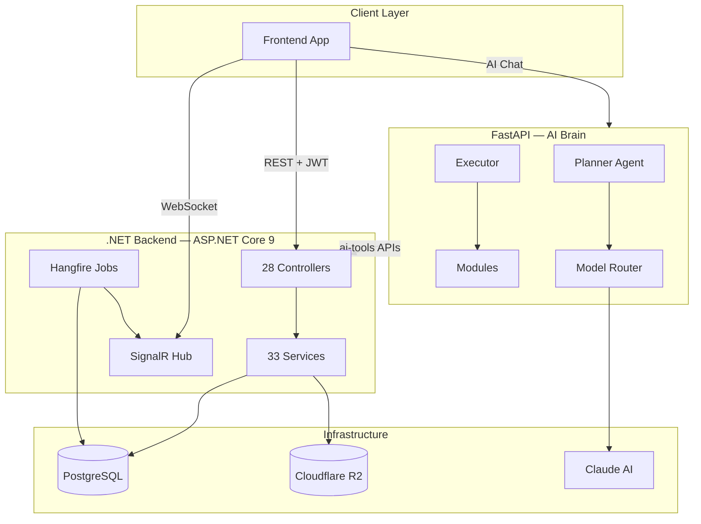

---

## 2. Clean Architecture Layers

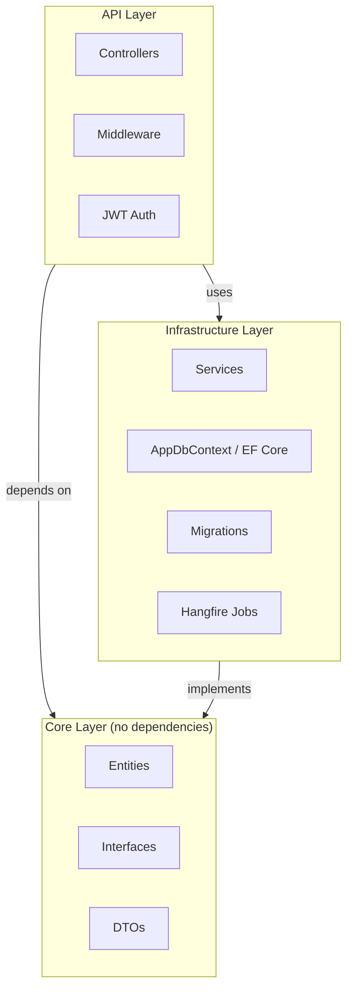

---

## 3. Authentication & JWT Flow

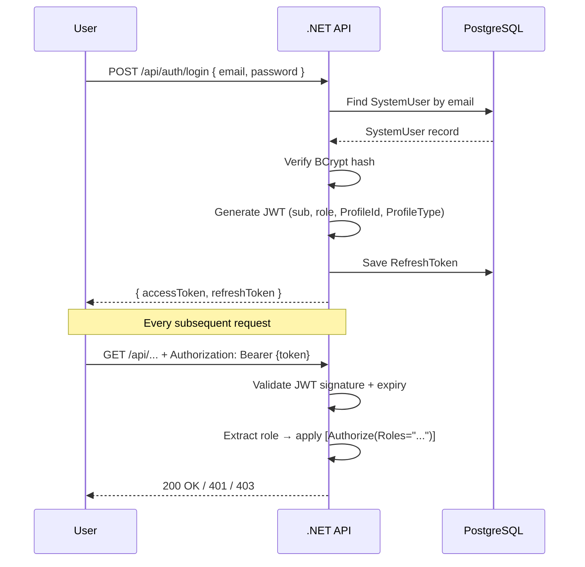

---

## 4. Role-Based Access Control

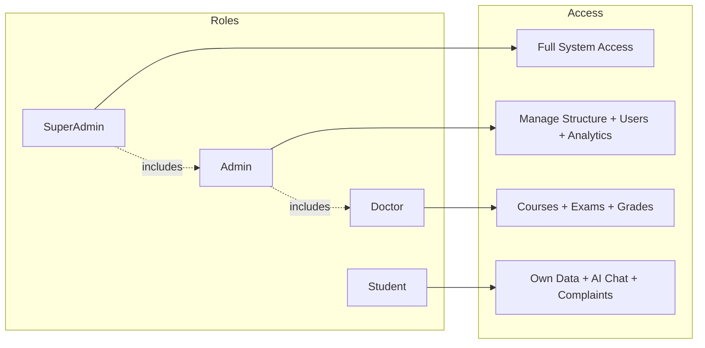

---

## 5. AI Chat Flow

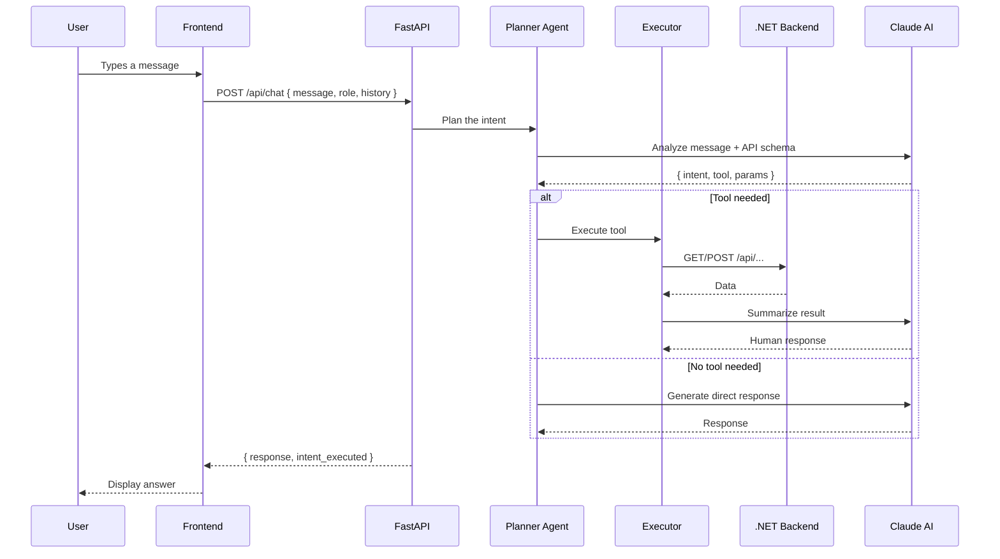

---

## 6. AI Planner Decision Tree

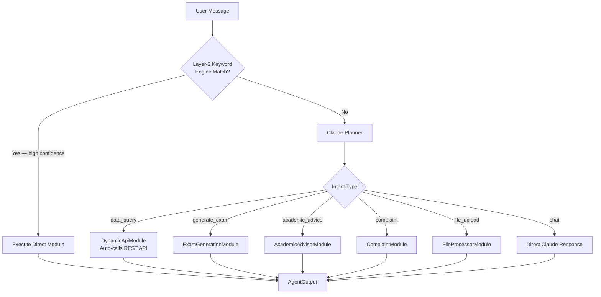

---

## 7. Randomized Exam Flow

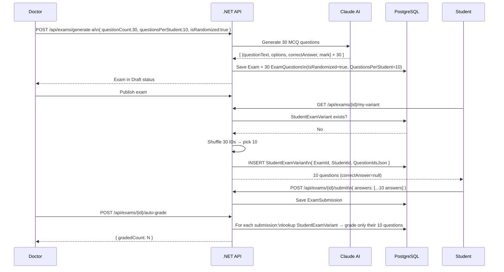

---

## 8. Enrollment & Academic Roadmap Flow

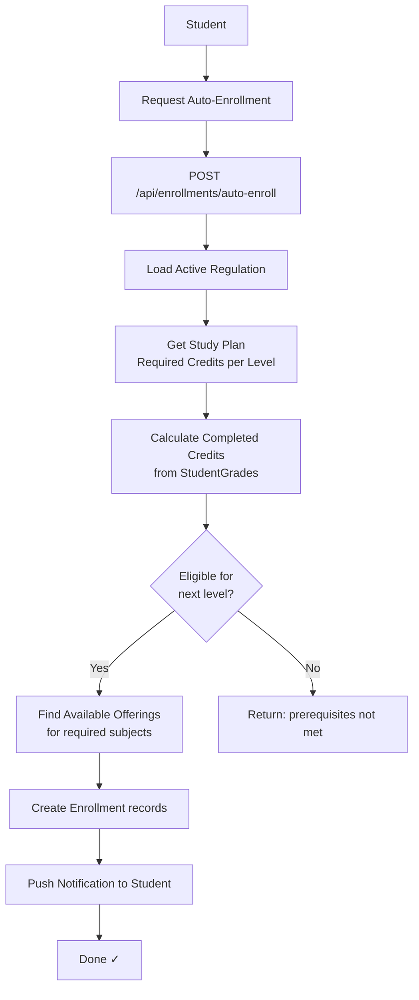

---

## 9. Notification System Flow

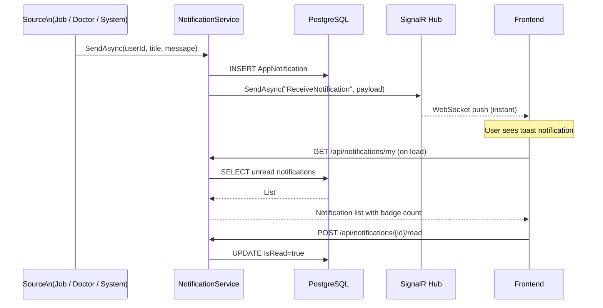

---

## 10. Background Jobs Schedule

```mermaid
gantt
    title Background Jobs (Hangfire)
    dateFormat HH:mm
    axisFormat %H:%M

    section Daily (Midnight)
    AcademicRiskJob         : 00:00, 30m

    section Every 30 Minutes
    ExamReminderJob         : 00:00, 30m
    ExamReminderJob         : 00:30, 30m

    section Weekly
    ComplaintIntelligenceJob (Weekly) : 00:00, 1h

    section Monthly
    ComplaintIntelligenceJob (Monthly): 00:00, 1h
```

---

## 11. Database — Core Entity Relationships

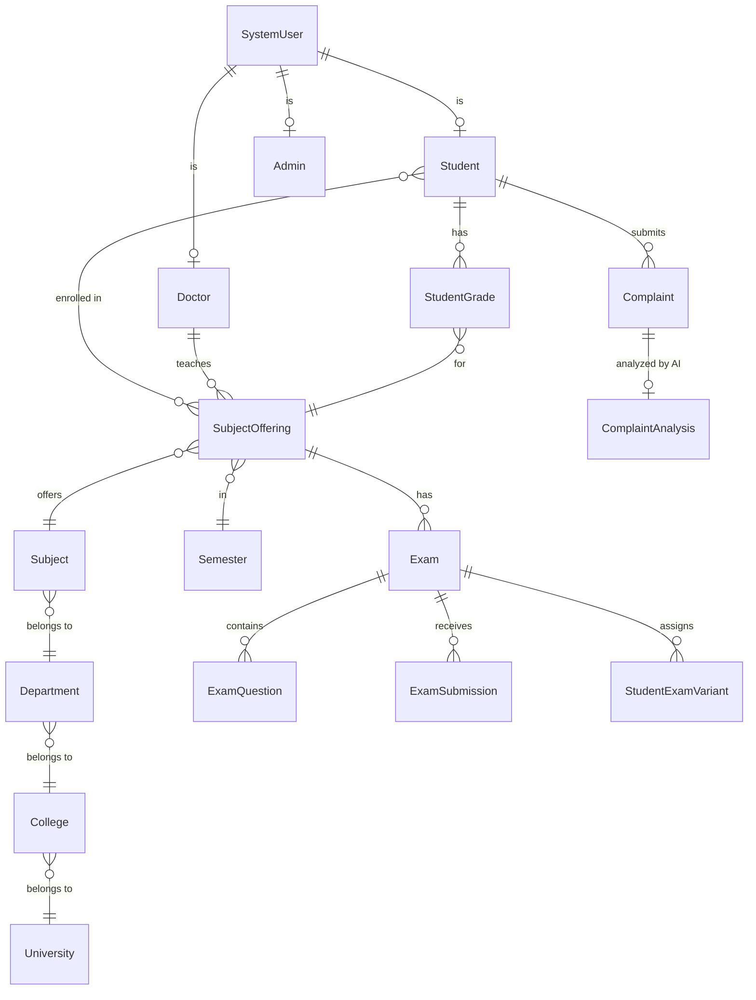

---

## 12. Complaint Intelligence Pipeline

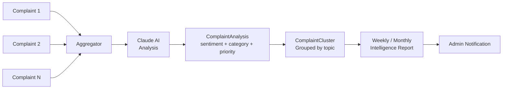

---

## 13. File Upload Flow

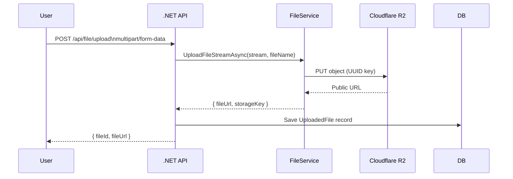

---

## 14. Deployment Architecture

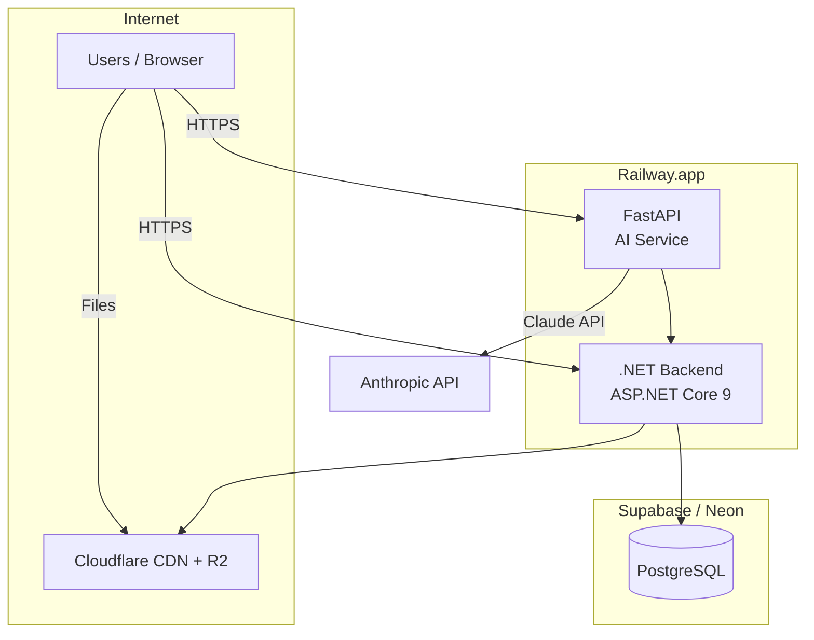
