# System Diagrams — Mermaid Source Files

> **Last refreshed:** 2026-05-31 | Generated from live codebase

All diagrams use [Mermaid](https://mermaid.js.org/) syntax. Paste into any Mermaid renderer (mermaid.live, GitHub, Notion, VS Code extension).

---

## Diagram 1 — Context Diagram (C1)

Shows the system in its environment: who uses it and what external services it depends on.

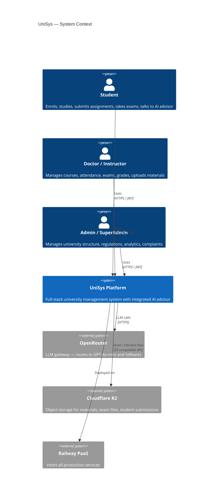

---

## Diagram 2 — System Overview (C2 — Container Level)

The big picture: every major container and how they connect.

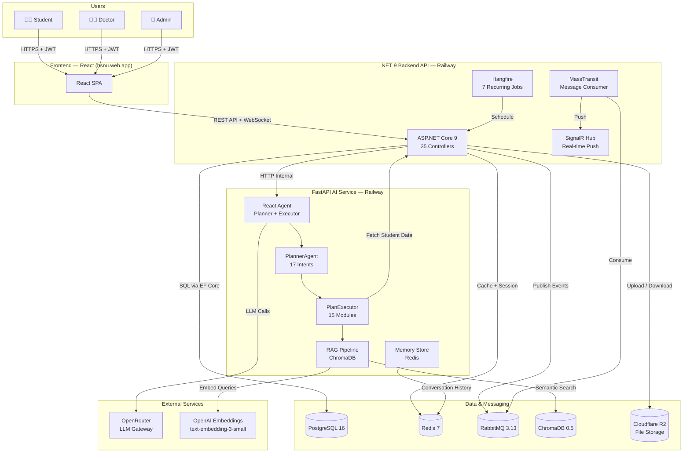

---

## Diagram 3 — Use Case Diagram

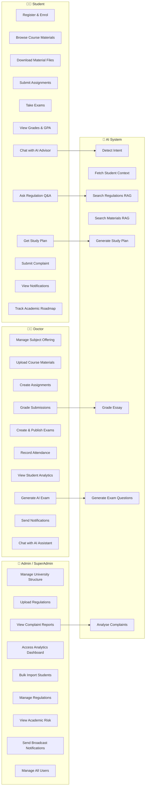

---

## Diagram 4 — Domain Class Diagram (Simplified ERD)

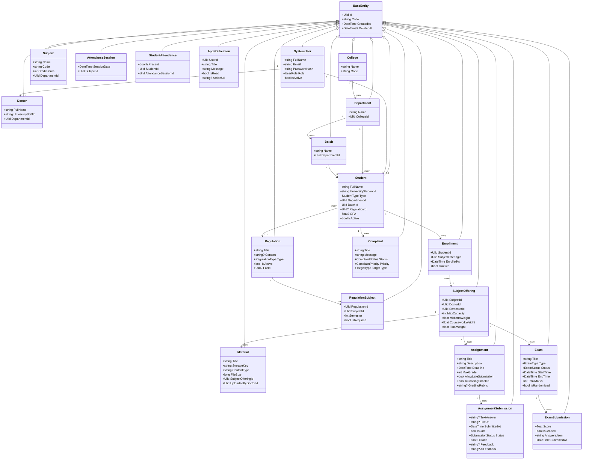

---

## Diagram 5A — Sequence: Student Asks AI About Course Material

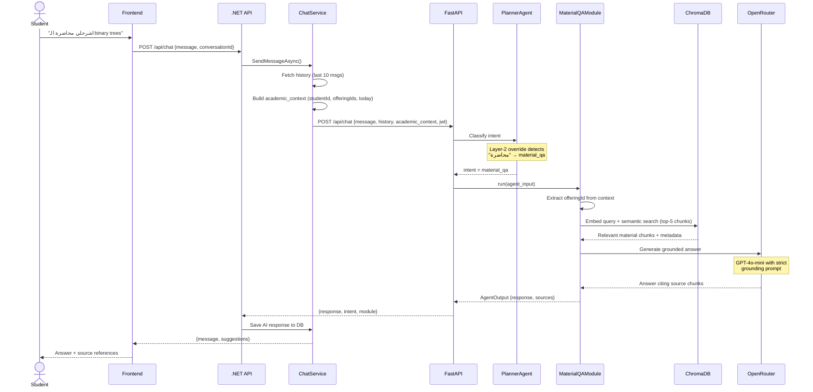

---

## Diagram 5B — Sequence: Assignment Submission Flow

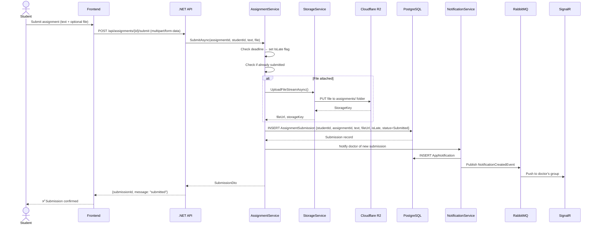

---

## Diagram 5C — Sequence: AI Grading Flow

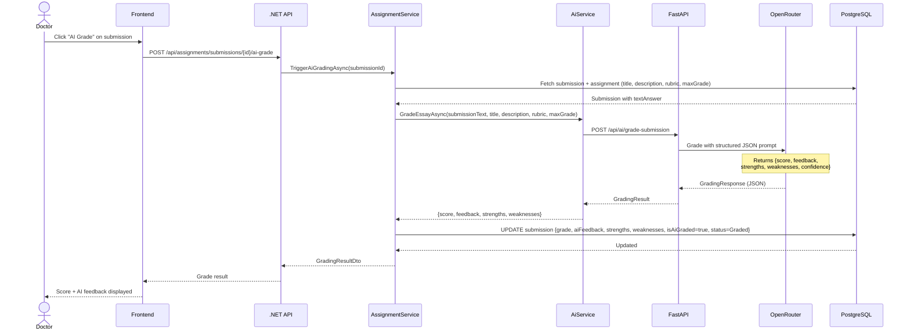

---

## Diagram 6A — Activity: Complete Student Journey

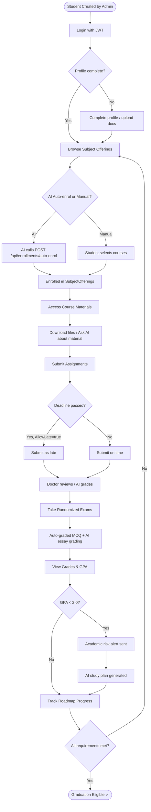

---

## Diagram 6B — Activity: AI Conversation Flow

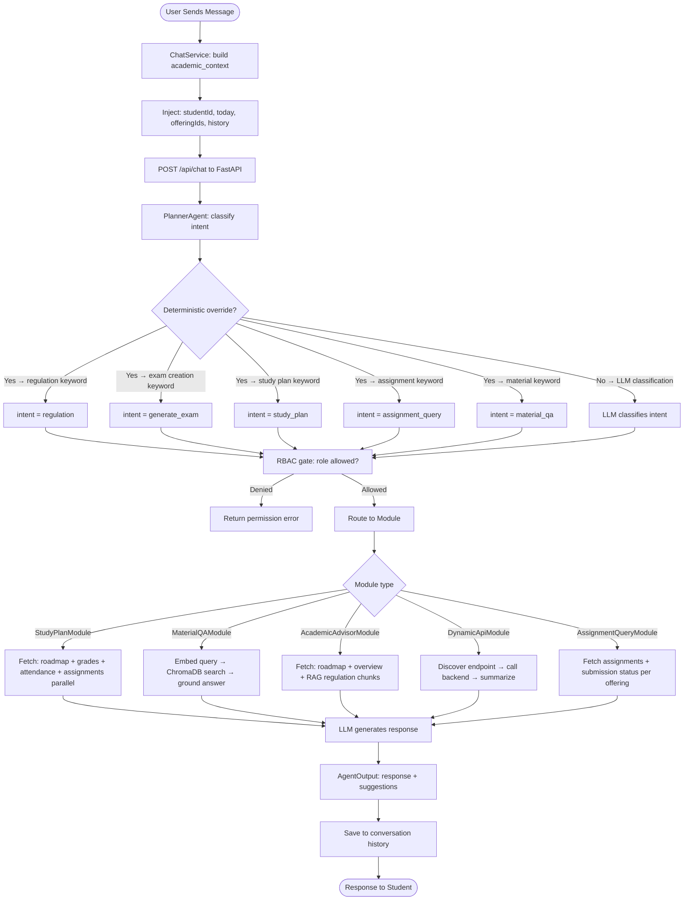

---

## Diagram 6C — Activity: Assignment Lifecycle

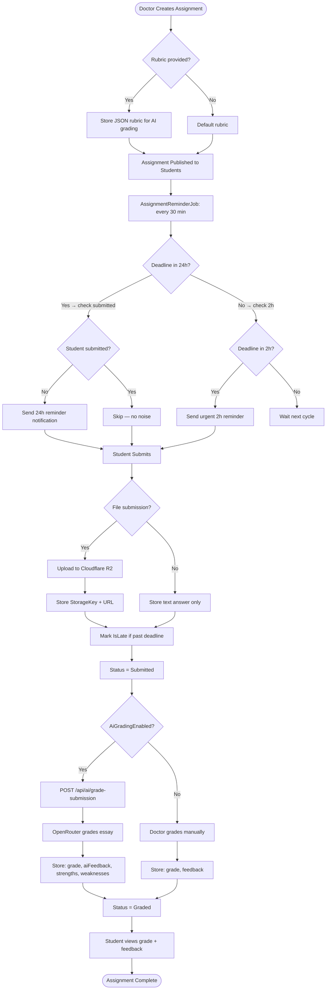

---

## Diagram 7 — Deployment Diagram (Railway)

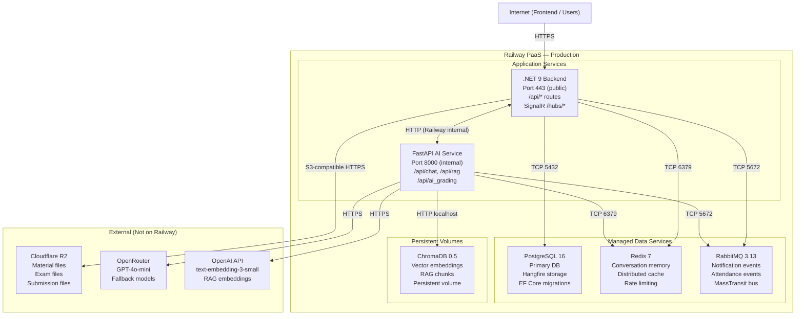

---

## Diagram 8 — ERD (Key Relationships)

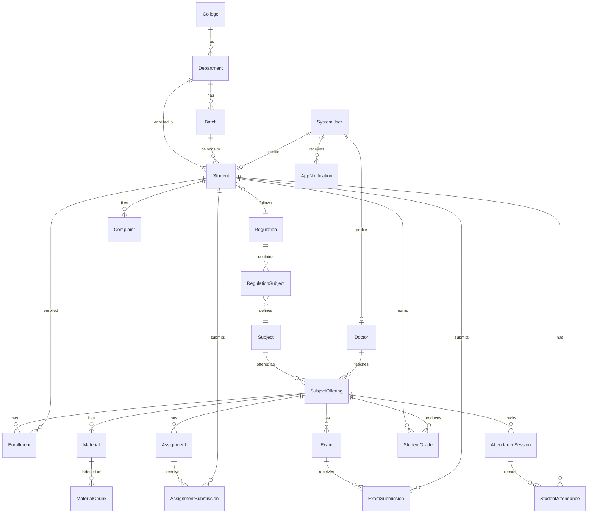
