# 23 — System Diagrams
## Visual Architecture Using Mermaid Diagrams

All diagrams use Mermaid syntax. Render them at https://mermaid.live or in any Markdown viewer that supports Mermaid.

---

## Diagram 1: Overall System Architecture

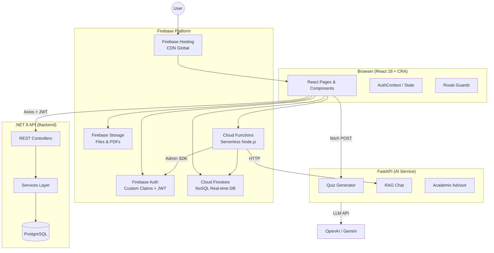

---

## Diagram 2: Folder Hierarchy

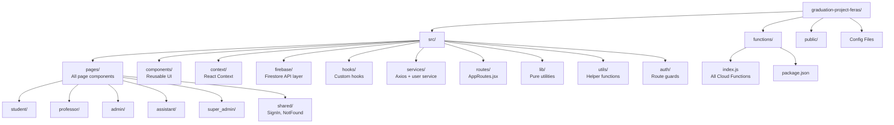

---

## Diagram 3: Authentication Flow

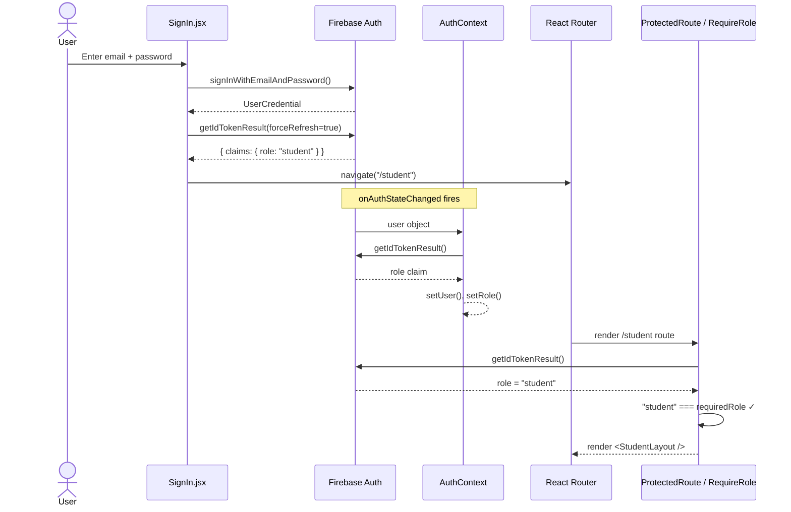

---

## Diagram 4: Routing Flow

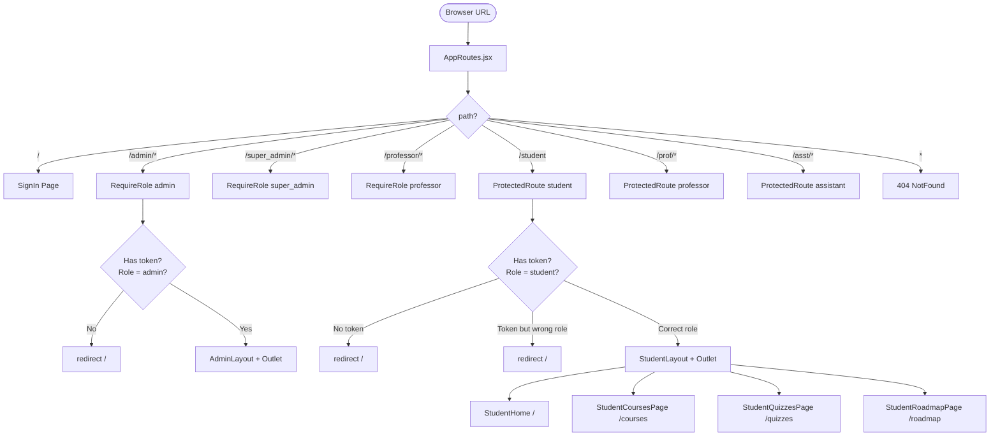

---

## Diagram 5: Quiz Feature — Sequence Diagram

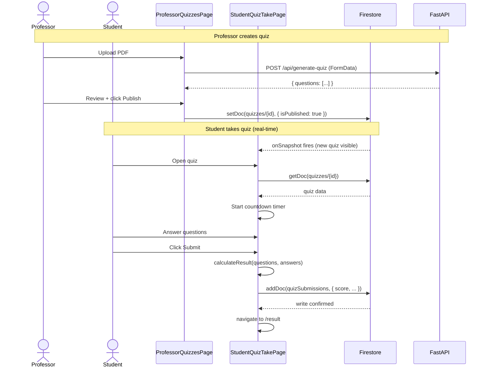

---

## Diagram 6: Engagement Tracker — Data Flow

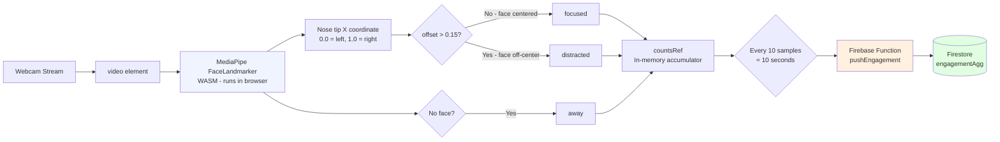

---

## Diagram 7: State Management Architecture

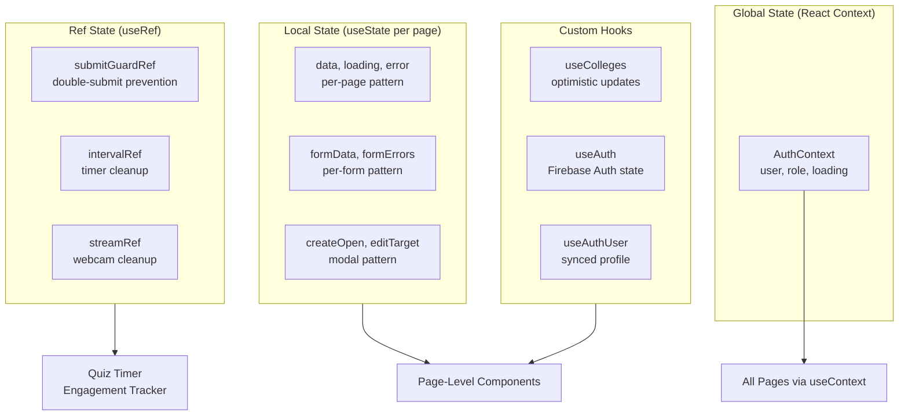

---

## Diagram 8: Firebase Security Rules — Decision Tree

```mermaid
flowchart TD
    REQ[Firestore Request] --> AUTH{Authenticated?}
    AUTH -->|No| DENY1[❌ Deny]
    AUTH -->|Yes| CLAIMS[Get role from token claims]

    CLAIMS --> ROLE{Role?}

    ROLE -->|super_admin| ALLOW_ALL[✅ Allow everything]
    ROLE -->|admin| ADMIN_CHECK{What collection?}
    ROLE -->|professor| PROF_CHECK{What collection?}
    ROLE -->|student| STUDENT_CHECK{What collection?}
    ROLE -->|assistant| ASST_CHECK{What collection?}

    ADMIN_CHECK -->|users, colleges, buildings| ALLOW_A[✅ Allow read/write]
    ADMIN_CHECK -->|quizzes, quizSubmissions| DENY_A[❌ Deny write]

    PROF_CHECK -->|prof_courses/{theirId}| ALLOW_P[✅ Allow own courses]
    PROF_CHECK -->|prof_courses/{otherId}| DENY_P[❌ Deny]
    PROF_CHECK -->|quizzes they created| ALLOW_P2[✅ Allow]

    STUDENT_CHECK -->|quizSubmissions/{theirId}| ALLOW_S[✅ Allow own]
    STUDENT_CHECK -->|quizSubmissions/{otherId}| DENY_S[❌ Deny]
    STUDENT_CHECK -->|quizzes isPublished=true| ALLOW_S2[✅ Allow read]
```

---

## Diagram 9: API Integration Layer

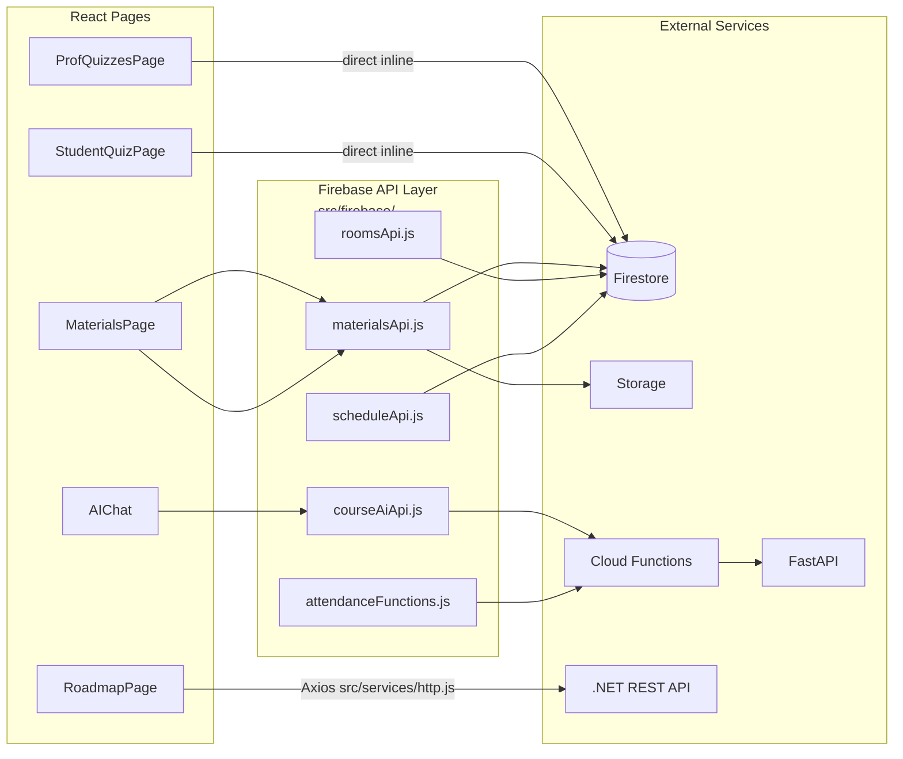

---

## Diagram 10: Component Hierarchy (Student Section)

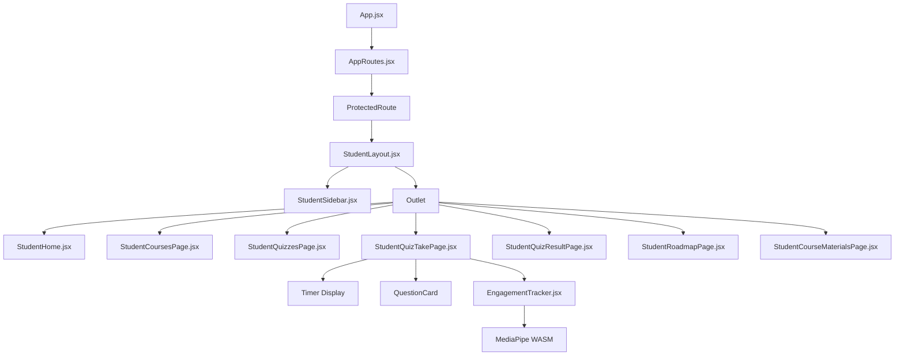

---

## Diagram 11: User Role Journey Map

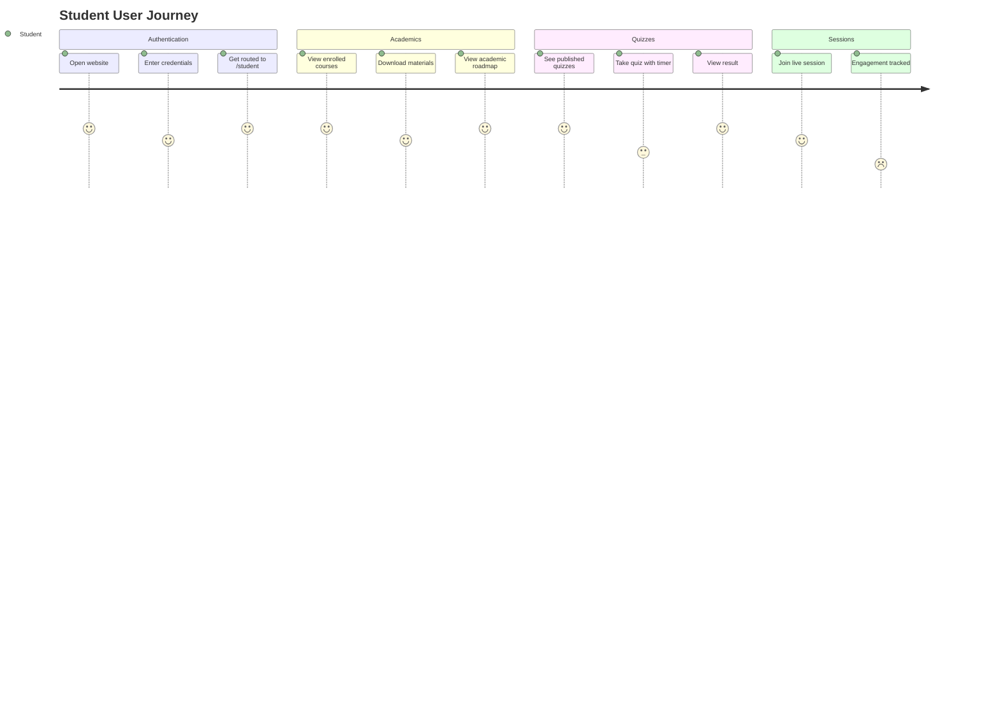

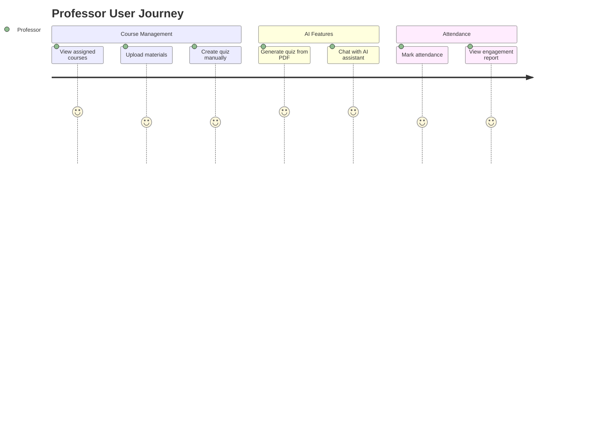

---

## Diagram 12: Data Entity Relationships

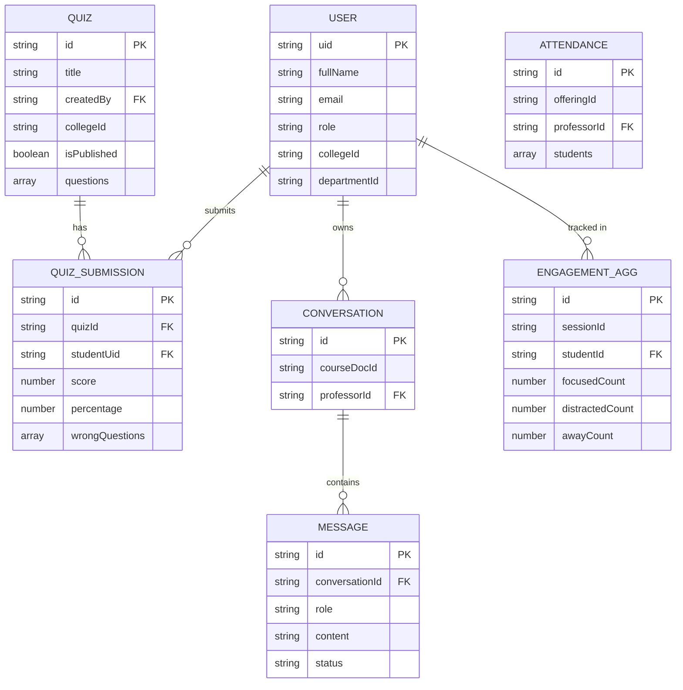

---

## Diagram 13: Build and Deployment Pipeline

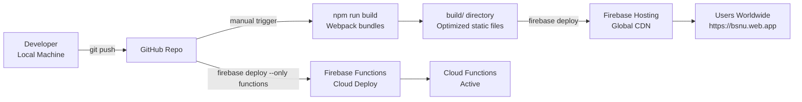

---

## Diagram 14: Dual Route Guard System

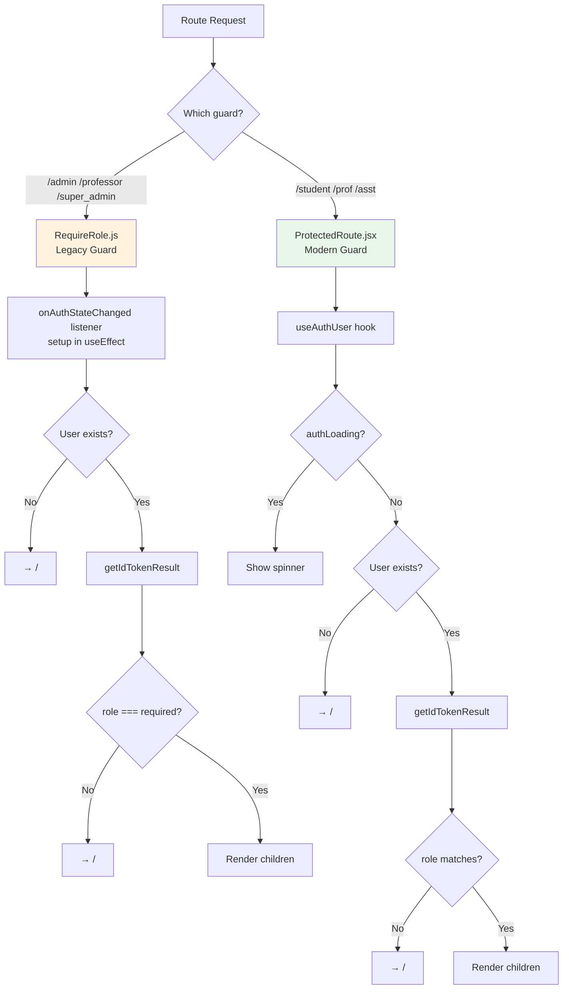
