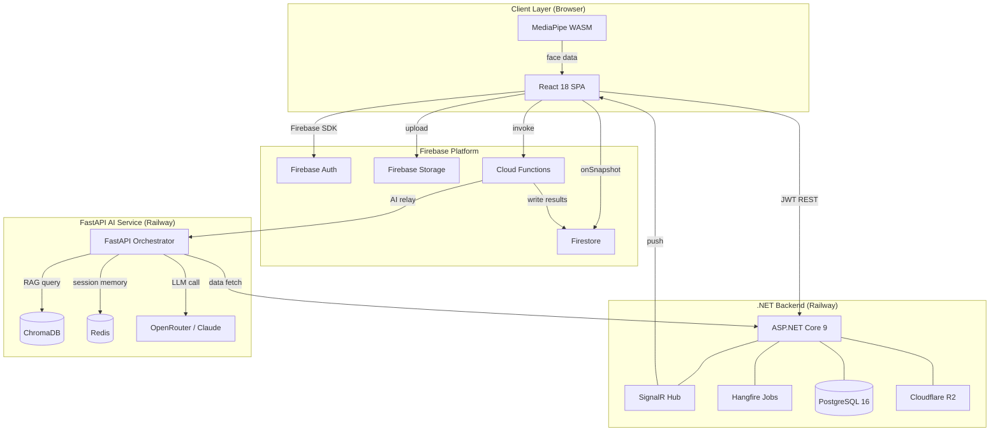

# High-Level Architecture

## 1. System Overview

The University Management System is a full-stack, multi-service platform that manages the complete academic lifecycle of a university: student enrollment, grades, schedules, examinations, attendance, AI-assisted advising, and real-time classroom engagement.

The system is decomposed into three collaborating services:

1. **.NET Backend** — the authoritative source of truth for all academic records.
2. **FastAPI AI Service** — an intelligent assistant layer that enriches user interactions with LLM reasoning and RAG-based knowledge retrieval.
3. **React Frontend** — a role-driven single-page application that unifies both backends and Firebase's real-time capabilities for classroom operations.

---

## 2. Three-Tier Architecture

```
┌─────────────────────────────────────────────────────────────────────────┐
│                          PRESENTATION TIER                              │
│                                                                         │
│   React 18 (SPA) + TypeScript                                           │
│   ┌──────────────┐  ┌──────────────┐  ┌──────────────┐                │
│   │  Student UI  │  │ Professor UI │  │   Admin UI   │                │
│   └──────────────┘  └──────────────┘  └──────────────┘                │
│   Material UI + Tailwind CSS                                            │
│   Firebase Auth SDK  |  Firebase SDK  |  Axios (REST calls)            │
└─────────────────────────────────┬───────────────────────────────────────┘
                                  │  HTTPS / WSS
          ┌───────────────────────┼────────────────────────┐
          │                       │                        │
          ▼                       ▼                        ▼
┌─────────────────┐   ┌───────────────────────┐   ┌──────────────────┐
│  .NET Backend   │   │  FastAPI AI Service   │   │    Firebase      │
│  (ASP.NET 9)    │   │  (Python 3.12)        │   │  (Google Cloud)  │
│                 │◄──┤                       │   │                  │
│  120+ REST      │   │  15 modules           │   │  Firestore       │
│  endpoints      │   │  17 intents           │   │  Auth            │
│  SignalR        │   │  Orchestrator         │   │  Storage         │
│  Hangfire       │   │  RAG pipeline         │   │  Functions       │
│                 │   │                       │   │                  │
└────────┬────────┘   └──────────┬────────────┘   └──────────────────┘
         │                       │
         ▼                       ▼
┌─────────────────┐   ┌───────────────────────┐
│  PostgreSQL 16  │   │  ChromaDB + Redis      │
│  (50+ tables)   │   │  (vectors + memory)   │
└─────────────────┘   └───────────────────────┘
```

---

## 3. Component Roles and Responsibilities

### 3.1 .NET Backend (ASP.NET Core 9)

The .NET backend is the **academic system of record**. It owns all long-lived, transactional data: students, professors, enrollments, grades, subjects, regulations, semesters, exams, assignments, and complaints.

**Key responsibilities:**
- Issuing and validating JWT tokens for role-based access control.
- Enforcing business rules: enrollment eligibility, prerequisite chains, GPA calculation.
- Managing file metadata (actual binaries stored in Cloudflare R2).
- Broadcasting real-time notifications via SignalR to connected clients.
- Running scheduled background operations via Hangfire (GPA recalculation, notification dispatch, deadline enforcement).
- Providing an internal REST API consumed by FastAPI for dynamic data retrieval.

**Technology decisions:**
- 35 controllers organized by domain (Auth, Student, Enrollment, Grade, Regulation, etc.).
- EF Core 9 with code-first migrations on PostgreSQL.
- Soft-delete across all entities using a `DeletedAt` timestamp column.
- Railway PaaS for deployment with environment variable injection.

### 3.2 FastAPI AI Service (Python 3.12)

The FastAPI service is the **AI and intelligence layer**. It accepts natural-language user messages, classifies them into intents, routes them to specialized modules, and synthesizes responses using LLM reasoning augmented by retrieved knowledge.

**Key responsibilities:**
- Intent classification — determining which module should handle a user's message.
- RAG retrieval — querying ChromaDB to find relevant lecture content for the query.
- Conversation memory — maintaining per-user session context in Redis.
- Dynamic API calls — fetching live academic data from .NET endpoints to ground LLM answers.
- Role enforcement — each intent is restricted to specific user roles (RBAC).

**Technology decisions:**
- Orchestrator design pattern: a central router dispatches to 15 domain modules.
- Claude (claude-sonnet) via OpenRouter as the LLM backbone.
- ChromaDB as the local vector database for embedding-based retrieval.
- Redis for short-term conversation memory (TTL-based expiry).

### 3.3 React Frontend (React 18)

The React frontend is the **user interface layer**. It presents completely separate route trees for each of the five roles and orchestrates calls to both backends plus Firebase.

**Key responsibilities:**
- Role-based routing (dual guard system: RequireRole + ProtectedRoute).
- Real-time classroom operations (quizzes, attendance, engagement) via Firebase.
- AI chat interface relayed through Firebase Cloud Functions to FastAPI.
- In-browser face detection for engagement tracking using Google MediaPipe.
- Quiz generation: sends lecture context to FastAPI, receives structured questions.

---

## 4. External Services

```
┌─────────────────────────────────────────────────────────────────────────┐
│                          EXTERNAL SERVICES                              │
│                                                                         │
│  ┌──────────────────┐  ┌──────────────────┐  ┌──────────────────────┐ │
│  │   OpenRouter     │  │  Cloudflare R2   │  │     Railway PaaS     │ │
│  │                  │  │                  │  │                      │ │
│  │  LLM routing     │  │  File storage    │  │  .NET + FastAPI      │ │
│  │  Claude-sonnet   │  │  Lecture PDFs    │  │  deployment          │ │
│  │  API gateway     │  │  Assignments     │  │  auto-scaling        │ │
│  └──────────────────┘  └──────────────────┘  └──────────────────────┘ │
│                                                                         │
│  ┌──────────────────┐  ┌──────────────────┐  ┌──────────────────────┐ │
│  │    Firebase      │  │  Google MediaPipe│  │     PostgreSQL       │ │
│  │                  │  │                  │  │   (Railway managed)  │ │
│  │  Auth, Firestore │  │  Face detection  │  │  50+ tables          │ │
│  │  Storage, Funcs  │  │  WASM in-browser │  │  EF Core migrations  │ │
│  └──────────────────┘  └──────────────────┘  └──────────────────────┘ │
└─────────────────────────────────────────────────────────────────────────┘
```

| Service | Purpose | Used By |
|---------|---------|---------|
| OpenRouter | LLM API gateway, routes to Claude | FastAPI |
| Cloudflare R2 | S3-compatible object storage | .NET backend |
| Railway PaaS | Cloud deployment platform | .NET + FastAPI |
| Firebase Auth | Identity for classroom operations | React frontend |
| Firebase Firestore | Real-time database for classroom data | React + Cloud Functions |
| Firebase Storage | Lecture PDF hosting | React + Cloud Functions |
| Firebase Cloud Functions | Serverless: AI relay, attendance, bulk import | React frontend |
| Google MediaPipe | In-browser face mesh and detection | React frontend |

---

## 5. Inter-Service Communication

### 5.1 React → .NET Backend

- Protocol: HTTPS REST (Axios)
- Authentication: JWT Bearer token in `Authorization` header
- Usage: All academic operations — login, enrollment, grades, regulations, exams, assignments

### 5.2 React → FastAPI AI Service

- Protocol: HTTPS REST (via Firebase Cloud Function relay)
- The Cloud Function forwards the request with the user's Firebase UID and role claims
- Usage: AI chat, quiz generation

### 5.3 React → Firebase

- Protocol: Firebase SDK (gRPC over HTTPS, WebSocket for real-time)
- Authentication: Firebase ID token (custom claims carry role)
- Usage: Quizzes, attendance, engagement scores, AI chat history

### 5.4 FastAPI → .NET Backend

- Protocol: Internal HTTPS REST (service-to-service calls)
- Authentication: Service API key header
- Usage: FastAPI modules call .NET to retrieve live academic data (e.g., student grades, schedule, enrolled subjects) before constructing LLM prompts

### 5.5 .NET → Firebase (optional)

- .NET can write notifications to Firestore for real-time delivery to the browser when SignalR is not available (mobile offline scenario).

---

## 6. High-Level Mermaid Architecture Diagram



---

## 7. Request Flow Examples

### 7.1 Student Views Their Grade

1. React calls `GET /api/grades/my` with JWT.
2. .NET middleware validates JWT, extracts student ID from claims.
3. EF Core queries `Grades` joined to `SubjectOfferings` and `Subjects`.
4. JSON response returned; React renders grade table.

### 7.2 Student Asks AI About Their Exam Schedule

1. React sends message to Firebase Cloud Function.
2. Cloud Function attaches UID + role claims, forwards to FastAPI.
3. FastAPI orchestrator classifies intent as `schedule_query`.
4. `schedule_query` module calls .NET `GET /api/schedule/student/{id}`.
5. .NET returns schedule JSON; module builds LLM prompt.
6. Claude generates a natural-language response.
7. FastAPI returns structured answer to Cloud Function.
8. Cloud Function writes answer to Firestore chat history.
9. React reads answer via onSnapshot, displays it instantly.

### 7.3 Professor Runs a Live Quiz

1. Professor creates quiz in React; data written to Firestore.
2. Students' React clients detect new quiz via onSnapshot.
3. Students submit answers; Firestore accumulates responses.
4. Cloud Function triggers on completion, computes scores, writes back.
5. Professor sees live leaderboard via onSnapshot.

---

## 8. Deployment Topology

```
Railway Project
├── Service: dotnet-api          (ASP.NET Core 9, port 8080)
│   └── Linked PostgreSQL plugin
├── Service: fastapi-ai          (Python 3.12, port 8000)
│   ├── Linked Redis plugin
│   └── ChromaDB (in-process or sidecar)
│
Firebase Project
├── Hosting: React SPA (CDN-served)
├── Auth: identity provider
├── Firestore: real-time database
├── Storage: lecture files
└── Functions: serverless Node.js workers
```

All Railway services communicate over Railway's private network (internal DNS), avoiding public internet round-trips for service-to-service calls.
