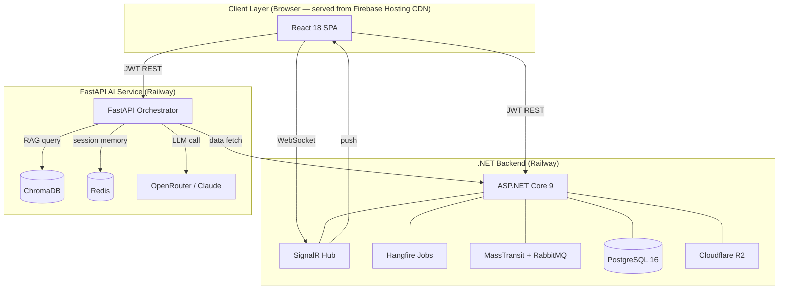

# High-Level Architecture

## 1. System Overview

The University Management System is a full-stack, multi-service platform that manages the complete academic lifecycle of a university: student enrollment, grades, schedules, examinations, attendance, AI-assisted advising, and real-time notifications.

The system is decomposed into two collaborating backend services and one frontend application:

1. **.NET Backend** — the authoritative source of truth for all academic records, authentication, and real-time push.
2. **FastAPI AI Service** — an intelligent assistant layer that enriches user interactions with LLM reasoning and RAG-based knowledge retrieval.
3. **React Frontend** — a role-driven single-page application deployed via Firebase Hosting (CDN only) that communicates directly with both backends over HTTPS.

---

## 2. Three-Tier Architecture

```
┌─────────────────────────────────────────────────────────────────────────┐
│                          PRESENTATION TIER                              │
│                                                                         │
│   React 18 (SPA) + TypeScript                                           │
│   ┌──────────────┐  ┌──────────────┐  ┌──────────────┐                │
│   │  Student UI  │  │ Professor UI │  │   Admin UI   │                │
│   └──────────────┘  └──────────────┘  └──────────────┘                │
│   Material UI + Tailwind CSS                                            │
│   Axios (REST calls to .NET) | Axios (REST calls to FastAPI)           │
└─────────────────────────────────┬───────────────────────────────────────┘
                                  │  HTTPS + JWT Bearer
                    ┌─────────────┴──────────────┐
                    │                            │
                    ▼                            ▼
┌─────────────────────────┐   ┌───────────────────────────┐
│     .NET Backend        │   │   FastAPI AI Service      │
│     (ASP.NET 9)         │   │   (Python 3.12)           │
│                         │◄──┤                           │
│  120+ REST endpoints    │   │  15 modules               │
│  JWT Auth               │   │  17 intents               │
│  SignalR (real-time)    │   │  Orchestrator             │
│  Hangfire (jobs)        │   │  RAG pipeline             │
│  RabbitMQ (events)      │   │                           │
└──────────┬──────────────┘   └──────────┬────────────────┘
           │                             │
           ▼                             ▼
┌──────────────────┐   ┌───────────────────────┐
│  PostgreSQL 16   │   │  ChromaDB + Redis      │
│  (50+ tables)    │   │  (vectors + memory)   │
└──────────────────┘   └───────────────────────┘
```

---

## 3. Component Roles and Responsibilities

### 3.1 .NET Backend (ASP.NET Core 9)

The .NET backend is the **academic system of record**. It owns all long-lived, transactional data: students, professors, enrollments, grades, subjects, regulations, semesters, exams, assignments, and complaints.

**Key responsibilities:**
- Issuing and validating JWT tokens for role-based access control.
- Enforcing business rules: enrollment eligibility, prerequisite chains, GPA calculation.
- Managing file metadata (actual binaries stored in Cloudflare R2).
- Broadcasting real-time notifications via SignalR to connected clients.
- Running scheduled background operations via Hangfire (GPA recalculation, notification dispatch, deadline enforcement).
- Providing an internal REST API consumed by FastAPI for dynamic data retrieval.

**Technology decisions:**
- 35 controllers organized by domain (Auth, Student, Enrollment, Grade, Regulation, etc.).
- EF Core 9 with code-first migrations on PostgreSQL.
- Soft-delete across all entities using a `DeletedAt` timestamp column.
- Railway PaaS for deployment with environment variable injection.

### 3.2 FastAPI AI Service (Python 3.12)

The FastAPI service is the **AI and intelligence layer**. It accepts natural-language user messages, classifies them into intents, routes them to specialized modules, and synthesizes responses using LLM reasoning augmented by retrieved knowledge.

**Key responsibilities:**
- Intent classification — determining which module should handle a user's message.
- RAG retrieval — querying ChromaDB to find relevant lecture content for the query.
- Conversation memory — maintaining per-user session context in Redis.
- Dynamic API calls — fetching live academic data from .NET endpoints to ground LLM answers.
- Role enforcement — each intent is restricted to specific user roles (RBAC).

**Technology decisions:**
- Orchestrator design pattern: a central router dispatches to 15 domain modules.
- Claude (claude-sonnet) via OpenRouter as the LLM backbone.
- ChromaDB as the local vector database for embedding-based retrieval.
- Redis for short-term conversation memory (TTL-based expiry).

### 3.3 React Frontend (React 18)

The React frontend is the **user interface layer**. It presents completely separate route trees for each of the five roles and communicates directly with both backends.

**Key responsibilities:**
- Role-based routing (dual guard system: RequireAuth + RequireRole, both backed by the .NET JWT).
- Submitting and retrieving academic data (enrollments, grades, exams, assignments) via the .NET REST API.
- Sending AI chat messages directly to the FastAPI service and streaming back responses.
- Receiving real-time notifications via SignalR connection to the .NET backend.
- Deployed as a static SPA on Firebase Hosting (CDN only — no Firebase backend services used).

---

## 4. External Services

```
┌─────────────────────────────────────────────────────────────────────────┐
│                          EXTERNAL SERVICES                              │
│                                                                         │
│  ┌──────────────────┐  ┌──────────────────┐  ┌──────────────────────┐ │
│  │   OpenRouter     │  │  Cloudflare R2   │  │     Railway PaaS     │ │
│  │                  │  │                  │  │                      │ │
│  │  LLM routing     │  │  File storage    │  │  .NET + FastAPI      │ │
│  │  Claude-sonnet   │  │  Lecture PDFs    │  │  deployment          │ │
│  │  API gateway     │  │  Assignments     │  │  auto-scaling        │ │
│  └──────────────────┘  └──────────────────┘  └──────────────────────┘ │
│                                                                         │
│  ┌──────────────────┐  ┌──────────────────┐  ┌──────────────────────┐ │
│  │ Firebase Hosting │  │    RabbitMQ      │  │     PostgreSQL       │ │
│  │                  │  │                  │  │   (Railway managed)  │ │
│  │  CDN for React   │  │  Async event bus │  │  50+ tables          │ │
│  │  SPA only        │  │  (Railway plugin)│  │  EF Core migrations  │ │
│  └──────────────────┘  └──────────────────┘  └──────────────────────┘ │
└─────────────────────────────────────────────────────────────────────────┘
```

| Service | Purpose | Used By |
|---------|---------|---------|
| OpenRouter | LLM API gateway, routes to Claude | FastAPI |
| Cloudflare R2 | S3-compatible object storage | .NET backend |
| Railway PaaS | Cloud deployment platform | .NET + FastAPI |
| Firebase Hosting | CDN serving the React SPA static files | Frontend deployment only |
| RabbitMQ | Async event bus for notification delivery | .NET → MassTransit consumer |

---

## 5. Inter-Service Communication

### 5.1 React → .NET Backend

- Protocol: HTTPS REST (Axios)
- Authentication: JWT Bearer token in `Authorization` header
- Usage: All academic operations — login, enrollment, grades, regulations, exams, assignments, proctoring, registrations

### 5.2 React → FastAPI AI Service

- Protocol: HTTPS REST (Axios, direct call)
- Authentication: JWT Bearer token forwarded from the .NET login flow
- Usage: AI chat, quiz generation, lecture intelligence queries

### 5.3 React → SignalR (.NET)

- Protocol: WebSocket (SignalR SDK)
- Authentication: JWT Bearer token
- Usage: Real-time notification delivery from .NET to connected browser clients

### 5.4 FastAPI → .NET Backend

- Protocol: Internal HTTPS REST (service-to-service calls)
- Authentication: Service API key header + forwarded student JWT
- Usage: FastAPI modules call .NET to retrieve live academic data (e.g., student grades, schedule, enrolled subjects) before constructing LLM prompts

---

## 6. High-Level Mermaid Architecture Diagram



---

## 7. Request Flow Examples

### 7.1 Student Views Their Grade

1. React calls `GET /api/grades/my` with JWT.
2. .NET middleware validates JWT, extracts student ID from claims.
3. EF Core queries `Grades` joined to `SubjectOfferings` and `Subjects`.
4. JSON response returned; React renders grade table.

### 7.2 Student Asks AI About Their Exam Schedule

1. React sends message directly to FastAPI `POST /api/chat` with JWT.
2. FastAPI orchestrator classifies intent as `schedule_query`.
3. `schedule_query` module calls .NET `GET /api/schedule/student/{id}` using the forwarded JWT.
4. .NET returns schedule JSON; module builds LLM prompt.
5. Claude generates a natural-language response.
6. FastAPI streams the answer back to the React client.
7. React displays the streamed response in the chat interface.

### 7.3 Professor Publishes Grades

1. Professor submits grades in React; Axios calls `POST /api/grades/publish` with JWT.
2. .NET validates, persists grades, fires `GradesPublished` domain event.
3. MassTransit picks up the event, publishes to RabbitMQ.
4. RabbitMQ consumer delivers notification to enrolled students via SignalR.
5. Students' React clients receive the push notification in real time.

---

## 8. Deployment Topology

```
Railway Project
├── Service: dotnet-api          (ASP.NET Core 9, port 8080)
│   ├── Linked PostgreSQL plugin
│   ├── Linked Redis plugin (rate limiting, distributed cache)
│   └── Linked RabbitMQ plugin
├── Service: fastapi-ai          (Python 3.12, port 8000)
│   ├── Linked Redis plugin (conversation memory)
│   └── ChromaDB (persistent volume)

Firebase
└── Hosting: React SPA (CDN-served static files only)
    └── Domain: bsnu.web.app
```

All Railway services communicate over Railway's private network (internal DNS), avoiding public internet round-trips for service-to-service calls.
