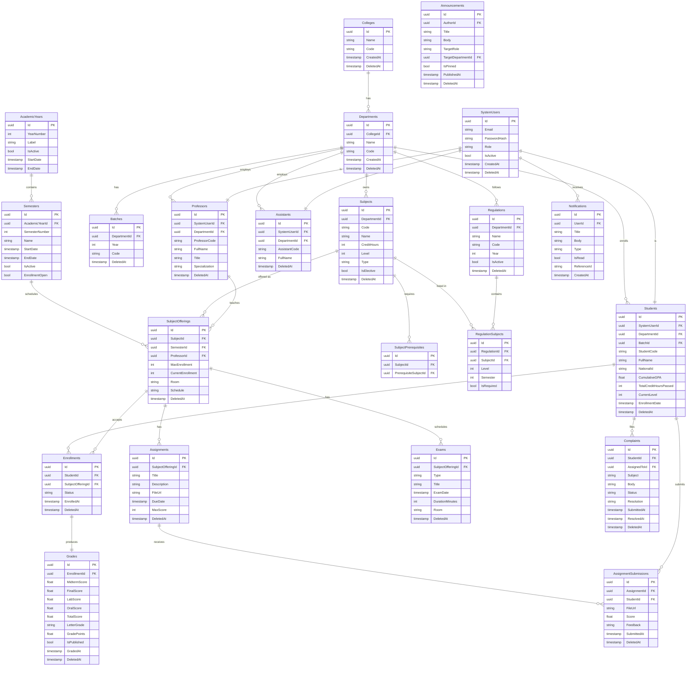

# Database Design

## 1. Overview

The PostgreSQL database is the authoritative persistent store for all academic data in the system. It is managed exclusively by the .NET backend through Entity Framework Core 9 (code-first, migrations-based). No other service writes directly to PostgreSQL; the FastAPI AI service retrieves data only through .NET REST endpoints.

**Key statistics:**
- 50+ tables
- All tables use soft-delete (`DeletedAt TIMESTAMP NULL`)
- Primary keys: `UUID` (GUID) for distributed-safe identity
- All timestamps stored as UTC
- Credit-hour weighted GPA calculation is performed in the application layer over normalized grade records

---

## 2. Core ER Diagram



---

## 3. Table Descriptions

### 3.1 Identity and Organization

| Table | Purpose |
|-------|---------|
| `SystemUsers` | Universal login record for all roles. Stores email, hashed password, role enum, and active flag. |
| `Colleges` | Top-level academic unit. A university has multiple colleges. |
| `Departments` | Academic departments within a college. Owns subjects, professors, and students. |
| `Batches` | A cohort of students entering a department in a specific year. |

### 3.2 Academic Structure

| Table | Purpose |
|-------|---------|
| `AcademicYears` | A named academic year (e.g., 2024/2025). Has a start/end date and an `IsActive` flag. |
| `Semesters` | A semester within an academic year. Controls enrollment windows via `EnrollmentOpen`. |
| `Subjects` | Curriculum subject definitions: credit hours, level, type (theory/lab/both), elective flag. |
| `SubjectPrerequisites` | Self-referential: a subject may require passing another subject first. |
| `Regulations` | A curriculum regulation document that defines which subjects a department requires and when. |
| `RegulationSubjects` | Maps subjects to regulations with level and semester placement. |

### 3.3 Scheduling and Enrollment

| Table | Purpose |
|-------|---------|
| `SubjectOfferings` | A specific section of a subject in a semester, assigned to a professor. Tracks capacity. |
| `Enrollments` | A student's registration in a subject offering. Status: Enrolled, Dropped, Completed. |

### 3.4 Assessment

| Table | Purpose |
|-------|---------|
| `Grades` | Grade record tied to an enrollment. Stores component scores (midterm, final, lab, oral) and computed totals. |
| `Assignments` | An assignment for a subject offering, with due date and file attachment link. |
| `AssignmentSubmissions` | Student submission for an assignment. Stores file URL and professor score/feedback. |
| `Exams` | Scheduled exam for a subject offering (midterm, final, makeup). Includes date, room, duration. |

### 3.5 Communication

| Table | Purpose |
|-------|---------|
| `Announcements` | System-wide or targeted announcements. Can be pinned. Targeted by role or department. |
| `Complaints` | Student complaints submitted to admin. Tracked with status and resolution fields. |
| `Notifications` | Per-user notification inbox. Supports mark-as-read. References source entity. |

---

## 4. Soft-Delete Strategy

Every entity table that represents a real-world object includes a `DeletedAt TIMESTAMP NULL` column. When a record is "deleted," the application sets `DeletedAt = UTC_NOW` rather than issuing a `DELETE` statement.

**Benefits:**
- Audit trail: deleted records are still queryable for reporting.
- Recovery: accidental deletions can be reversed by setting `DeletedAt = NULL`.
- Referential integrity: FK relationships remain valid even when the referenced record is soft-deleted.
- Grade history preservation: even if a subject or offering is retired, the grade records remain valid.

**EF Core Implementation:**

```csharp
// Global query filter applied in DbContext
modelBuilder.Entity<Student>().HasQueryFilter(e => e.DeletedAt == null);
```

All queries automatically exclude soft-deleted records unless explicitly overridden with `IgnoreQueryFilters()`.

---

## 5. GPA Calculation Schema

GPA is calculated using the credit-hour-weighted formula:

```
GPA = SUM(GradePoints * CreditHours) / SUM(CreditHours)
```

Where `GradePoints` is derived from `LetterGrade` using the standard 4.0 scale:

| Letter Grade | Grade Points | Total Score Range |
|-------------|-------------|------------------|
| A+ | 4.0 | 95 – 100 |
| A | 4.0 | 90 – 94 |
| A- | 3.7 | 85 – 89 |
| B+ | 3.3 | 80 – 84 |
| B | 3.0 | 75 – 79 |
| B- | 2.7 | 70 – 74 |
| C+ | 2.3 | 65 – 69 |
| C | 2.0 | 60 – 64 |
| D | 1.0 | 50 – 59 |
| F | 0.0 | Below 50 |

The `Grades.TotalScore` is computed as:

```
TotalScore = (MidtermScore * weight) + (FinalScore * weight) + LabScore + OralScore
```

The `CumulativeGPA` on the `Students` table is a **denormalized cache** recalculated by a Hangfire background job whenever a grade is published. This avoids expensive real-time aggregations across all enrollment records.

---

## 6. Key Relationships and Constraints

### Enrollment Eligibility
Before inserting into `Enrollments`, the backend validates:
1. The student's regulation against `RegulationSubjects` to ensure the subject belongs to the student's level/semester.
2. The `SubjectPrerequisites` table to confirm all prerequisite subjects have a passing grade.
3. The `SubjectOfferings.MaxEnrollment` vs `CurrentEnrollment` to enforce capacity.

### Grade → Enrollment (one-to-one)
Each enrollment yields exactly one grade record. The grade is created in a pending state when enrollment occurs and updated when scores are entered by the professor.

### Offering Capacity (optimistic concurrency)
`SubjectOfferings.CurrentEnrollment` is incremented atomically using a database transaction with a row-level lock, preventing race conditions during high-volume enrollment windows.

---

## 7. Indexes and Performance

| Table | Index | Purpose |
|-------|-------|---------|
| `Students` | `(DepartmentId, BatchId)` | Filter students by cohort |
| `Students` | `(SystemUserId)` UNIQUE | Lookup by login |
| `Enrollments` | `(StudentId, SubjectOfferingId)` UNIQUE | Prevent duplicate enrollment |
| `Grades` | `(EnrollmentId)` UNIQUE | One grade per enrollment |
| `SubjectOfferings` | `(SemesterId, SubjectId)` | Schedule queries |
| `Notifications` | `(UserId, IsRead)` | Inbox queries |
| `Announcements` | `(TargetRole, DeletedAt)` | Role-targeted announcement feed |
| `Complaints` | `(StudentId, Status)` | Student complaint history |
| `SystemUsers` | `(Email)` UNIQUE | Login lookup |

All indexes on columns involved in soft-delete queries include the `DeletedAt IS NULL` predicate (partial indexes) to minimize index size.

---

## 8. Migration Strategy

EF Core code-first migrations are applied automatically at application startup using:

```csharp
app.MigrateDatabase(); // extension method wrapping context.Database.Migrate()
```

Migrations are sequential and tracked in the `__EFMigrationsHistory` table. On Railway, the migration runs once per deployment before the application begins serving traffic, ensuring schema consistency.

---

## 9. Connection Pooling

The application uses Npgsql (the .NET PostgreSQL driver) with connection pooling:

- Minimum pool size: 5
- Maximum pool size: 100
- Connection lifetime: 300 seconds
- Command timeout: 30 seconds

These settings are configured via the connection string and tuned for Railway's PostgreSQL plugin which provides up to 100 concurrent connections on the standard plan.
