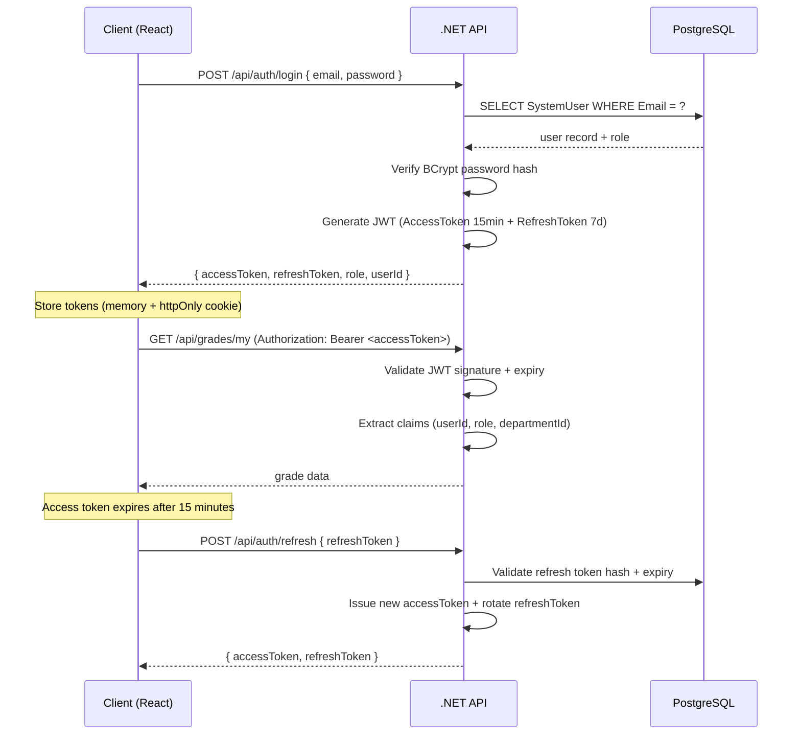
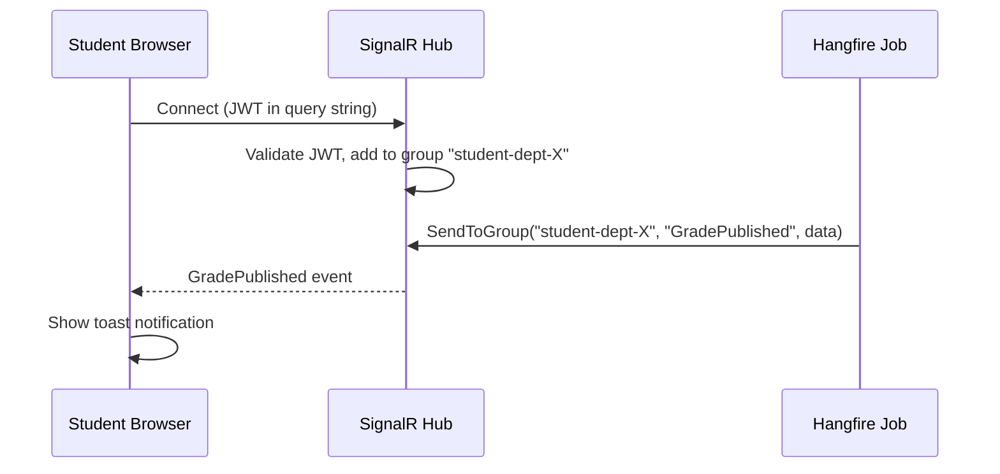

# API Design

## 1. Overview

The .NET backend exposes a RESTful HTTP API with 35 controllers and over 120 endpoints. The API follows REST conventions strictly: resource-centric URLs, standard HTTP methods, and uniform response envelopes. All endpoints are secured with JWT Bearer authentication except for the authentication endpoints themselves.

This document covers the design principles, authentication flow, major endpoint groups, request/response conventions, error handling, and security considerations.

---

## 2. REST Design Principles

The API adheres to the following REST design rules:

### 2.1 Resource-Centric URLs

URLs identify resources, not actions. Verbs come from the HTTP method.

```
GET    /api/students              — list students
GET    /api/students/{id}         — get one student
POST   /api/students              — create student
PUT    /api/students/{id}         — full update
PATCH  /api/students/{id}         — partial update
DELETE /api/students/{id}         — soft delete
```

### 2.2 Nested Resources for Relationships

```
GET  /api/subjects/{id}/offerings          — offerings for a subject
GET  /api/offerings/{id}/enrollments       — enrollments in an offering
GET  /api/students/{id}/grades             — grades for a student
POST /api/offerings/{id}/assignments       — add assignment to offering
```

### 2.3 Query Parameters for Filtering, Sorting, Paging

```
GET /api/students?departmentId=X&level=2&page=1&pageSize=20&sortBy=name
GET /api/announcements?role=Student&pinned=true
GET /api/grades?semesterId=X&published=true
```

### 2.4 Versioning

API versioning is handled via the URL prefix (`/api/v1/`, `/api/v2/`) and is currently at v1. The version prefix is optional in the current deployment but reserved for future breaking changes.

---

## 3. Authentication Flow

### 3.1 JWT Lifecycle



### 3.2 JWT Claims Structure

```json
{
  "sub": "uuid-of-system-user",
  "userId": "uuid-of-system-user",
  "entityId": "uuid-of-student-or-professor",
  "role": "Student",
  "departmentId": "uuid-of-department",
  "email": "student@university.edu",
  "iat": 1718000000,
  "exp": 1718000900
}
```

The `entityId` claim is critical — it maps the generic `SystemUser` to the domain entity (Student, Professor, Assistant, Admin). This claim is used in all authorization checks that need to identify "the logged-in student's own data."

### 3.3 Role Hierarchy

```
SuperAdmin > Admin > Professor = Assistant > Student
```

Role-based authorization is enforced using ASP.NET Core's `[Authorize(Roles = "...")]` attribute at the controller or action level, supplemented by ownership checks in the service layer.

---

## 4. Endpoint Groups

### 4.1 Authentication (`/api/auth`)

| Method | Path | Access | Description |
|--------|------|--------|-------------|
| POST | `/api/auth/login` | Public | Authenticate user, get JWT tokens |
| POST | `/api/auth/refresh` | Public | Refresh access token |
| POST | `/api/auth/logout` | Authenticated | Invalidate refresh token |
| GET | `/api/auth/me` | Authenticated | Get current user profile |
| POST | `/api/auth/change-password` | Authenticated | Change own password |

### 4.2 Students (`/api/students`)

| Method | Path | Access | Description |
|--------|------|--------|-------------|
| GET | `/api/students` | Admin+ | List all students (paginated) |
| GET | `/api/students/{id}` | Admin, Professor, self | Get student profile |
| POST | `/api/students` | Admin+ | Create student (also creates SystemUser) |
| PUT | `/api/students/{id}` | Admin+ | Update student details |
| DELETE | `/api/students/{id}` | SuperAdmin | Soft-delete student |
| GET | `/api/students/{id}/grades` | Admin, Professor, self | Student's grade history |
| GET | `/api/students/{id}/roadmap` | Admin, self | Enrollment-based roadmap |
| GET | `/api/students/{id}/transcript` | Admin, self | Official transcript |

### 4.3 Enrollments (`/api/enrollments`)

| Method | Path | Access | Description |
|--------|------|--------|-------------|
| POST | `/api/enrollments` | Student | Enroll in a subject offering |
| DELETE | `/api/enrollments/{id}` | Student | Drop enrollment (within window) |
| GET | `/api/enrollments/my` | Student | Own current enrollments |
| GET | `/api/enrollments?offeringId=X` | Professor | Students enrolled in offering |
| PATCH | `/api/enrollments/{id}/status` | Admin | Override enrollment status |

### 4.4 Grades (`/api/grades`)

| Method | Path | Access | Description |
|--------|------|--------|-------------|
| GET | `/api/grades/my` | Student | Own grades (current + history) |
| GET | `/api/grades/{enrollmentId}` | Professor, Admin | Get specific grade record |
| PUT | `/api/grades/{enrollmentId}` | Professor | Enter/update grade scores |
| POST | `/api/grades/{enrollmentId}/publish` | Professor | Publish grade to student |
| GET | `/api/grades/offering/{id}` | Professor | All grades for an offering |
| POST | `/api/grades/bulk-publish` | Professor | Publish all grades for offering |

### 4.5 Subjects and Offerings (`/api/subjects`, `/api/offerings`)

| Method | Path | Access | Description |
|--------|------|--------|-------------|
| GET | `/api/subjects` | All | List subjects (filtered by dept/level) |
| POST | `/api/subjects` | Admin+ | Create subject |
| GET | `/api/offerings` | All | Available offerings this semester |
| POST | `/api/offerings` | Admin+ | Schedule a new offering |
| GET | `/api/offerings/{id}/schedule` | All | Time/room schedule for offering |

### 4.6 Regulations (`/api/regulations`)

| Method | Path | Access | Description |
|--------|------|--------|-------------|
| GET | `/api/regulations` | All | List regulations by department |
| GET | `/api/regulations/{id}` | All | Get regulation with subjects |
| POST | `/api/regulations` | SuperAdmin | Create regulation |
| PUT | `/api/regulations/{id}` | SuperAdmin | Update regulation |
| POST | `/api/regulations/{id}/subjects` | SuperAdmin | Add subject to regulation |
| DELETE | `/api/regulations/{id}/subjects/{subjectId}` | SuperAdmin | Remove subject |

### 4.7 Announcements (`/api/announcements`)

| Method | Path | Access | Description |
|--------|------|--------|-------------|
| GET | `/api/announcements` | All (filtered by role) | List announcements for current user |
| POST | `/api/announcements` | Admin+ | Create announcement |
| PATCH | `/api/announcements/{id}/pin` | Admin+ | Toggle pin state |
| DELETE | `/api/announcements/{id}` | Admin+ | Soft-delete |

### 4.8 Assignments (`/api/assignments`)

| Method | Path | Access | Description |
|--------|------|--------|-------------|
| GET | `/api/assignments/my` | Student | Assignments for enrolled subjects |
| POST | `/api/assignments` | Professor | Create assignment |
| POST | `/api/assignments/{id}/submit` | Student | Upload submission |
| GET | `/api/assignments/{id}/submissions` | Professor | View all submissions |
| PUT | `/api/assignments/{id}/submissions/{subId}/grade` | Professor | Grade a submission |

### 4.9 Complaints (`/api/complaints`)

| Method | Path | Access | Description |
|--------|------|--------|-------------|
| POST | `/api/complaints` | Student | File a complaint |
| GET | `/api/complaints/my` | Student | Own complaint history |
| GET | `/api/complaints` | Admin+ | All complaints |
| PATCH | `/api/complaints/{id}/resolve` | Admin+ | Resolve with comment |

### 4.10 Notifications (`/api/notifications`)

| Method | Path | Access | Description |
|--------|------|--------|-------------|
| GET | `/api/notifications` | Authenticated | Get notification inbox |
| PATCH | `/api/notifications/{id}/read` | Authenticated | Mark as read |
| PATCH | `/api/notifications/read-all` | Authenticated | Mark all as read |

### 4.11 File Upload (`/api/files`)

| Method | Path | Access | Description |
|--------|------|--------|-------------|
| POST | `/api/files/upload` | Professor, Admin | Upload file to Cloudflare R2 |
| GET | `/api/files/{key}/url` | Authenticated | Get signed URL for download |
| DELETE | `/api/files/{key}` | Admin+ | Delete file from R2 |

---

## 5. Request and Response Conventions

### 5.1 Standard Response Envelope

All responses are wrapped in a consistent envelope:

```json
{
  "success": true,
  "data": { ... },
  "message": "Operation completed successfully",
  "errors": null,
  "pagination": {
    "page": 1,
    "pageSize": 20,
    "totalCount": 245,
    "totalPages": 13
  }
}
```

For error responses:

```json
{
  "success": false,
  "data": null,
  "message": "Validation failed",
  "errors": [
    { "field": "email", "message": "Email is required" },
    { "field": "password", "message": "Password must be at least 8 characters" }
  ]
}
```

### 5.2 Pagination

All list endpoints support cursor-based or offset pagination:

```
GET /api/students?page=2&pageSize=20
```

Response includes `pagination` metadata in the envelope.

### 5.3 Date Format

All dates and timestamps use ISO 8601 format in UTC:

```
"2024-10-15T09:30:00Z"
```

### 5.4 UUID Format

All IDs are lowercase UUID v4:

```
"id": "a3bb189e-8bf9-3888-9912-ace4e6543002"
```

---

## 6. Error Handling Strategy

### 6.1 HTTP Status Codes

| Status | Meaning | When Used |
|--------|---------|-----------|
| 200 | OK | Successful GET, PUT, PATCH |
| 201 | Created | Successful POST |
| 204 | No Content | Successful DELETE |
| 400 | Bad Request | Validation errors, malformed input |
| 401 | Unauthorized | Missing or invalid JWT |
| 403 | Forbidden | Valid JWT but insufficient role/ownership |
| 404 | Not Found | Resource does not exist or is soft-deleted |
| 409 | Conflict | Duplicate resource (e.g., re-enrollment) |
| 422 | Unprocessable | Business rule violation (e.g., prerequisite not met) |
| 500 | Server Error | Unhandled exception |

### 6.2 Global Exception Middleware

A global exception handler middleware intercepts all unhandled exceptions and returns a structured `500` response without leaking stack traces to clients. Exceptions are logged with full context using Serilog.

### 6.3 Validation

Input validation uses FluentValidation. Validation errors are collected and returned as a `400 Bad Request` with the `errors` array populated per-field.

---

## 7. Security

### 7.1 JWT Security

- Tokens signed with HMAC-SHA256 using a 256-bit secret key stored in Railway environment variables.
- Access token TTL: 15 minutes.
- Refresh token TTL: 7 days, stored as a hashed value in the database.
- Refresh tokens are single-use (rotated on each use).

### 7.2 CORS Configuration

Allowed origins are explicitly configured per environment:

- Development: `localhost:3000`, `localhost:5173`
- Production: Firebase Hosting domain + any additional front-end domains

All other origins receive a CORS rejection at the middleware level before hitting any controller.

### 7.3 Rate Limiting

ASP.NET Core rate limiting middleware is applied:

- Authentication endpoints: 5 requests/minute per IP
- General API: 100 requests/minute per authenticated user
- File upload: 10 uploads/minute per user

### 7.4 Input Sanitization

- EF Core uses parameterized queries exclusively — raw SQL injection is not possible through normal code paths.
- File uploads are validated for MIME type and size before forwarding to Cloudflare R2.
- String inputs are length-validated before database writes.

### 7.5 Ownership Checks

Role-based `[Authorize]` attributes handle coarse-grained access. Service-layer ownership checks handle fine-grained access:

```csharp
// Student can only access their own grades
if (grade.Enrollment.StudentId != currentStudentId)
    throw new ForbiddenException();
```

---

## 8. SignalR Real-Time Notifications

The `/hubs/notifications` SignalR endpoint pushes real-time events to connected clients:

- Connection is authenticated using the same JWT token (passed as a query parameter).
- Events: `NewAnnouncement`, `GradePublished`, `AssignmentDue`, `ComplaintResolved`.
- Clients join groups corresponding to their role and department for targeted delivery.


