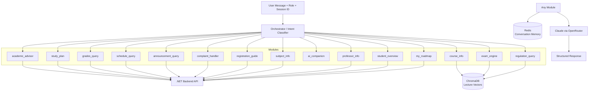
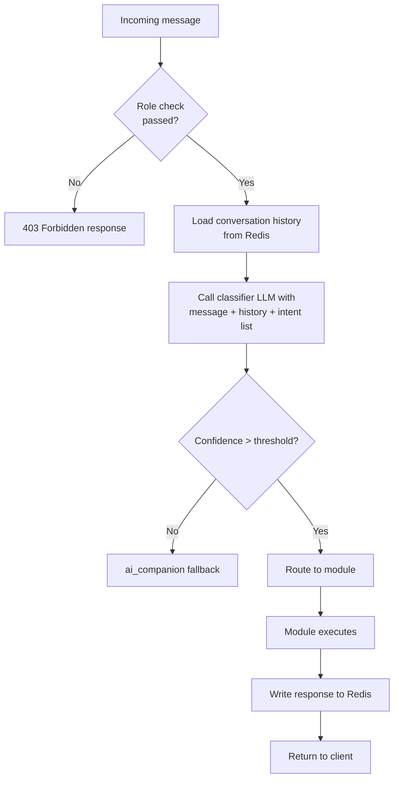
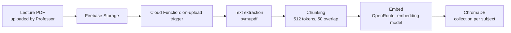
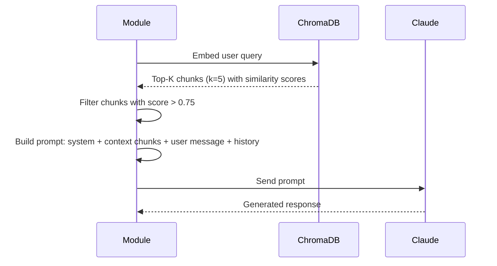

# AI System Design

## 1. Overview

The FastAPI AI Service is the intelligence layer of the university management system. It receives natural-language messages from students and professors, determines intent, retrieves relevant context from vector storage and live backend data, and generates responses using a large language model.

The service is built on three foundational patterns:

1. **Orchestrator pattern** — a central router classifies user intent and dispatches to the correct module.
2. **RAG (Retrieval-Augmented Generation)** — lecture content is embedded into ChromaDB and retrieved at query time to ground LLM responses in factual course material.
3. **Conversation memory** — Redis stores per-session message history, giving the LLM context continuity across multi-turn conversations.

---

## 2. High-Level AI Architecture



---

## 3. Orchestrator and Intent Classification

### 3.1 Intent List

The orchestrator recognizes 17 intents:

| Intent | Module | Allowed Roles |
|--------|--------|---------------|
| `academic_advice` | academic_advisor | Student |
| `study_plan` | study_plan | Student |
| `exam_info` | exam_engine | Student, Professor |
| `grades_query` | grades_query | Student, Professor, Admin |
| `course_info` | course_info | Student, Professor |
| `schedule_query` | schedule_query | Student, Professor, Assistant |
| `announcement_query` | announcement_query | All |
| `complaint_help` | complaint_handler | Student |
| `general_chat` | ai_companion | All |
| `registration_guide` | registration_guide | Student |
| `regulation_query` | regulation_query | Student, Professor, Admin |
| `subject_info` | subject_info | All |
| `professor_info` | professor_info | Student, Admin |
| `student_overview` | student_overview | Professor, Admin |
| `my_roadmap` | my_roadmap | Student |
| `quiz_generation` | exam_engine | Professor |
| `complaint_status` | complaint_handler | Student, Admin |

### 3.2 Classification Flow



The classifier uses a lightweight prompt to classify intent:

```
Given the following user message and the available intent list,
classify the message into exactly one intent.
Return ONLY the intent name with no explanation.

Available intents: [list]
User message: [message]
```

This two-stage approach (first classify, then execute) keeps module prompts focused and avoids prompt bloat from loading all module context for every request.

---

## 4. RAG Pipeline

### 4.1 Ingestion Pipeline (Document Indexing)



**Chunking strategy:**
- Each PDF page is split into 512-token chunks with a 50-token overlap.
- Metadata attached to each chunk: `subjectCode`, `subjectName`, `chapterTitle`, `pageNumber`, `uploadedBy`, `semesterId`.

**Collection naming:**
- ChromaDB collection per subject: `subject_{subjectCode}` (e.g., `subject_CS301`)
- A separate `regulations` collection stores curriculum regulation text.

### 4.2 Query Pipeline (Retrieval at Chat Time)



### 4.3 RAG-Enabled Modules

| Module | ChromaDB Collection |
|--------|-------------------|
| `course_info` | `subject_{code}` |
| `exam_engine` | `subject_{code}` |
| `regulation_query` | `regulations` |

Other modules do not use RAG — they rely on live API calls to .NET instead.

---

## 5. Conversation Memory Design

### 5.1 Redis Structure

Each session maintains a conversation history list in Redis:

```
Key:   chat:{userId}:{sessionId}
Type:  Redis List (LPUSH / LRANGE)
TTL:   24 hours (auto-expire on inactivity)
```

Each list element is a JSON object:

```json
{
  "role": "user",
  "content": "What is my GPA?",
  "timestamp": "2024-10-15T09:30:00Z",
  "intent": "grades_query"
}
```

### 5.2 Context Window Management

To avoid exceeding the LLM's context window, the service applies a sliding window strategy:

- Load the last **N** messages from Redis (configurable, default 10).
- If the total token count exceeds a threshold (e.g., 2000 tokens), trim the oldest messages until under the limit.
- Always preserve the system prompt and the current user message.

### 5.3 Session vs. User Memory

- **Session memory** (in Redis, TTL 24h): detailed message history for in-progress conversations.
- **Persistent memory** (in Firestore, written by Cloud Function): a summary of past sessions stored per user, used by `academic_advisor` to understand long-term context.

---

## 6. Module Descriptions

### 6.1 `academic_advisor`

**Purpose:** The flagship graduation-defense feature. Provides deep, personalized academic guidance combining regulation analysis, the student's roadmap, their grade history, and long-form LLM reasoning.

**Flow:**
1. Fetch student profile, regulation requirements, completed subjects, current GPA from .NET.
2. Fetch student roadmap (subjects remaining, prerequisites outstanding).
3. Retrieve relevant regulation text chunks from ChromaDB.
4. Build a long-form prompt combining all context.
5. Generate a structured advisory response with concrete recommendations.

**Output:** Structured JSON with sections: `summary`, `gpa_analysis`, `remaining_requirements`, `recommended_next_steps`, `warnings`.

### 6.2 `study_plan`

**Purpose:** Generate a weekly or semester-level study plan based on the student's enrolled subjects and their upcoming exam/assignment schedule.

**Data sources:** .NET (enrollments, assignments, exam schedule).

### 6.3 `exam_engine`

**Purpose (Student):** Answer questions about upcoming exams, rooms, dates, and preparation tips.

**Purpose (Professor):** Generate quiz questions from lecture content.

**Quiz generation flow:**
1. Professor specifies subject, chapter, number of questions, difficulty.
2. Module retrieves relevant lecture chunks from ChromaDB.
3. LLM generates structured multiple-choice questions in JSON.
4. Questions are returned to Firebase for live quiz creation.

**Output format:**

```json
{
  "questions": [
    {
      "question": "What is the time complexity of quicksort in the average case?",
      "options": ["O(n)", "O(n log n)", "O(n²)", "O(log n)"],
      "correct": 1,
      "explanation": "..."
    }
  ]
}
```

### 6.4 `grades_query`

**Purpose:** Answer natural-language questions about grades. "What did I get in Data Structures?" "Which subject dragged my GPA down?"

**Data source:** .NET grades endpoint.

### 6.5 `schedule_query`

**Purpose:** Parse and explain the student's or professor's schedule. Handle queries like "Do I have a lab on Wednesday?" or "When is my CS301 lecture?"

### 6.6 `announcement_query`

**Purpose:** Surface relevant announcements in response to natural-language queries. "Are there any announcements about the midterm?"

### 6.7 `complaint_handler`

**Purpose:** Help students draft and submit complaints, and check the status of existing complaints.

### 6.8 `ai_companion`

**Purpose:** General conversational fallback for off-topic or ambiguous messages. Keeps users engaged without routing to a wrong module.

### 6.9 `registration_guide`

**Purpose:** Walk students through the enrollment process. Explain which subjects are available, prerequisites, and registration windows.

### 6.10 `regulation_query`

**Purpose:** Answer questions about the curriculum regulation. "How many credit hours do I need to graduate?" "Is CS401 required for my track?"

**Data source:** ChromaDB `regulations` collection + .NET regulations endpoint.

### 6.11 `my_roadmap`

**Purpose:** Show the student's personalized academic roadmap: completed subjects (green), currently enrolled (yellow), remaining (grey), prerequisites blocking progress (red).

**Data source:** .NET `/api/students/{id}/roadmap`.

### 6.12 `student_overview` (Professor/Admin use)

**Purpose:** Allow professors and admins to query a student's academic summary: "Show me Ahmed's grade history" or "Which students in my class have a GPA below 2.0?"

---

## 7. LLM Prompt Strategy

### 7.1 System Prompt Structure

Every LLM call uses a multi-part system prompt:

```
[1] Role definition: "You are a university academic assistant..."
[2] Behavioral constraints: "Always respond in the user's language...", "Never fabricate data..."
[3] Context block: Retrieved chunks or live API data
[4] Output format instruction: JSON schema or natural text
[5] Conversation history (last N turns)
[6] Current user message
```

### 7.2 Data Grounding Rule

Modules that fetch live data from .NET inject that data explicitly into the prompt context. The LLM is instructed:

```
Use only the data provided below. Do not invent grade scores, subject names,
or dates. If the information is not in the provided data, say so.
```

This prevents hallucination of academic records.

### 7.3 Response Language

The system prompt instructs Claude to detect and respond in the user's message language (Arabic or English), ensuring native-language support without separate prompt variants.

---

## 8. Dynamic API Calls (FastAPI → .NET)

Modules that require live data make internal HTTP calls to the .NET backend using a shared HTTP client:

```python
async def fetch_student_grades(student_id: str, token: str) -> dict:
    response = await http_client.get(
        f"{DOTNET_BASE_URL}/api/grades/my",
        headers={"Authorization": f"Bearer {token}"}
    )
    return response.json()
```

The user's JWT token is forwarded to the .NET backend, ensuring the same authorization rules apply. The FastAPI service does not hold its own database connection to PostgreSQL.

---

## 9. Error Handling and Fallbacks

| Scenario | Behavior |
|----------|---------|
| Intent confidence below threshold | Fall back to `ai_companion` |
| .NET API returns non-200 | Return user-friendly error message in chat |
| ChromaDB query returns 0 results | Respond without RAG context, note limitation to user |
| LLM timeout or API error | Return structured error: "I'm having trouble connecting to the AI right now" |
| Redis unavailable | Continue without conversation history (stateless fallback) |
| Role not permitted for intent | Return 403 with explanation |

---

## 10. Performance Considerations

- **Async I/O:** All module functions are `async` using `httpx` for HTTP calls and `asyncio` for parallelism.
- **Parallel data fetching:** When a module needs multiple .NET endpoints, requests are issued concurrently using `asyncio.gather`.
- **ChromaDB locality:** ChromaDB runs in the same Railway service as FastAPI, avoiding network latency for vector queries.
- **LLM latency:** Average response time ~2–4 seconds for a RAG-augmented query. Streaming is enabled for chat responses to improve perceived performance.
