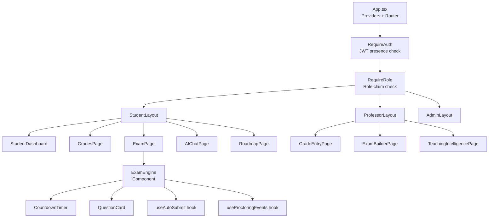
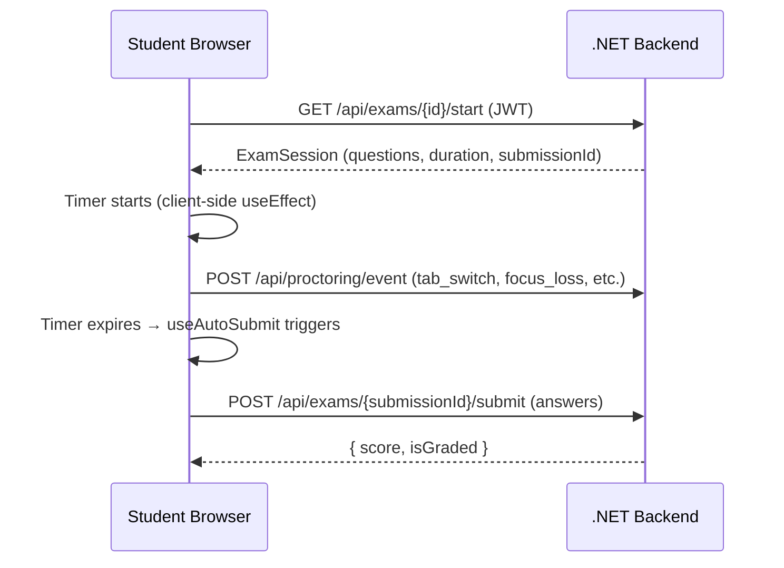

# Frontend Architecture

## 1. Overview

The React 18 frontend is the user-facing layer of the university management system. It is a TypeScript single-page application that communicates with two backends — the .NET academic API and the FastAPI AI service — under a single, role-driven interface.

The application supports five roles, each with a completely separate route tree and feature set. A dual route guard architecture enforces role-based access at both the navigation level and the data level. The frontend is deployed as a static SPA via Firebase Hosting (CDN only — no Firebase backend services are used).

---

## 2. Technology Stack

| Concern | Technology |
|---------|-----------|
| UI framework | React 18 + TypeScript |
| Styling | Material UI (MUI) + Tailwind CSS |
| Routing | React Router v6 |
| State management | React Context + custom hooks |
| HTTP client | Axios (for .NET API + FastAPI) |
| Real-time | SignalR client SDK (notifications from .NET) |
| Auth | JWT Bearer — issued by .NET `POST /api/auth/login` |
| File handling | Cloudflare R2 (via .NET pre-signed URLs) |
| Build tool | Vite |
| Deployment | Firebase Hosting (static CDN only) |

---

## 3. Application Structure

```
src/
├── app/
│   ├── App.tsx                    — root component, router, providers
│   ├── routes/
│   │   ├── StudentRoutes.tsx
│   │   ├── ProfessorRoutes.tsx
│   │   ├── AssistantRoutes.tsx
│   │   ├── AdminRoutes.tsx
│   │   └── SuperAdminRoutes.tsx
│   └── guards/
│       ├── RequireAuth.tsx        — JWT presence guard
│       └── RequireRole.tsx        — role claim guard
│
├── features/
│   ├── auth/                      — login, JWT token management
│   ├── student/
│   │   ├── grades/
│   │   ├── enrollments/
│   │   ├── roadmap/
│   │   ├── exams/
│   │   └── ai-chat/
│   ├── professor/
│   │   ├── grading/
│   │   ├── assignments/
│   │   ├── exam-builder/
│   │   └── teaching-intelligence/
│   ├── assistant/
│   │   ├── attendance/
│   │   └── announcements/
│   ├── admin/
│   │   ├── users/
│   │   └── bulk-import/
│   └── superadmin/
│       └── regulations/
│
├── shared/
│   ├── components/               — reusable UI components
│   ├── hooks/                    — shared custom hooks
│   ├── services/
│   │   ├── api.ts                — Axios instance (JWT interceptor)
│   │   ├── aiApi.ts              — Axios instance for FastAPI
│   │   └── signalr.ts            — SignalR hub connection
│   └── types/                    — shared TypeScript types
│
└── config/
    └── routes.config.ts
```

---

## 4. Component Hierarchy



---

## 5. Dual Route Guard System

The application uses two separate guard components that compose to create the complete access control layer:

### 5.1 `RequireAuth`

Checks whether a valid JWT token exists in memory/localStorage.

```typescript
// If no JWT token → redirect to /login
// If token exists → render children
const RequireAuth = ({ children }) => {
  const { token, loading } = useAuth();
  if (loading) return <LoadingSpinner />;
  if (!token) return <Navigate to="/login" replace />;
  return children;
};
```

### 5.2 `RequireRole`

Checks whether the JWT claims include the required role.

```typescript
// If decoded JWT role !== allowedRole → redirect to /unauthorized
const RequireRole = ({ role, children }) => {
  const { claims } = useAuth();
  if (claims?.role !== role) return <Navigate to="/unauthorized" replace />;
  return children;
};
```

### 5.3 Guard Composition

```tsx
<RequireAuth>
  <RequireRole role="Student">
    <StudentRoutes />
  </RequireRole>
</RequireAuth>
```

---

## 6. Auth Flow

All authentication is handled exclusively by the .NET backend.

```typescript
interface AuthContextValue {
  token: string | null;           // JWT from .NET /api/auth/login
  claims: JwtClaims | null;       // { role, entityId, departmentId, ... }
  loading: boolean;
  login: (email, password) => Promise<void>;
  logout: () => void;
}
```

**Login sequence:**
1. User submits credentials in the React login form.
2. React calls `POST /api/auth/login` on the .NET backend.
3. .NET validates credentials, issues a signed JWT with role claims.
4. React stores the JWT in `AuthContext` (and optionally `localStorage`).
5. All subsequent requests include `Authorization: Bearer <token>`.

---

## 7. State Management Strategy

The application avoids heavy state management libraries in favor of:

1. **React Context** for global state (auth, current user, theme).
2. **Custom hooks** for feature-level state encapsulation.
3. **SignalR `onmessage` handlers** as the reactive source for real-time notification data.
4. **React Query** for .NET / FastAPI API calls — handles caching, background refetch, loading/error states.

---

## 8. Real-Time Notifications

Real-time push from the backend is delivered via **SignalR** (the .NET `NotificationsHub`).

```typescript
// Establish SignalR connection after login
const connection = new HubConnectionBuilder()
  .withUrl('/hubs/notifications', {
    accessTokenFactory: () => getToken(),
  })
  .withAutomaticReconnect()
  .build();

connection.on('ReceiveNotification', (notification) => {
  addToast(notification.message, notification.type);
});

await connection.start();
```

The connection is started once after login and torn down on logout. All server-pushed events (grade published, exam reminder, assignment deadline, risk alert) arrive through this single hub.

---

## 9. HTTP Layer (.NET + FastAPI Calls)

Two Axios instances are configured — one for the .NET backend and one for FastAPI:

```typescript
// api.ts — .NET backend
const api = axios.create({ baseURL: import.meta.env.VITE_API_URL });

api.interceptors.request.use(config => {
  const token = getToken();
  if (token) config.headers.Authorization = `Bearer ${token}`;
  return config;
});

api.interceptors.response.use(
  response => response,
  async error => {
    if (error.response?.status === 401 && !error.config._retry) {
      error.config._retry = true;
      const newToken = await refreshAccessToken();
      setToken(newToken);
      error.config.headers.Authorization = `Bearer ${newToken}`;
      return api(error.config);
    }
    return Promise.reject(error);
  }
);

// aiApi.ts — FastAPI AI service (same JWT forwarded)
const aiApi = axios.create({ baseURL: import.meta.env.VITE_AI_URL });
aiApi.interceptors.request.use(config => {
  const token = getToken();
  if (token) config.headers.Authorization = `Bearer ${token}`;
  return config;
});
```

---

## 10. Exam Engine Design

The exam engine runs timed exams entirely client-side, with proctoring events sent to the .NET backend.

### 10.1 Data Flow



### 10.2 Timer and Auto-Submit

The quiz timer is managed client-side using `useEffect` + `setInterval`. When the countdown reaches zero, the `useAutoSubmit` hook:
1. Collects all current answers from local component state.
2. Calls `POST /api/exams/{submissionId}/submit` on the .NET backend.
3. Navigates the student to the results page.

### 10.3 Proctoring Hook

The `useProctoringEvents` hook attaches browser event listeners and sends events to the .NET proctoring endpoint:

```typescript
useEffect(() => {
  const onVisibilityChange = () => {
    if (document.hidden)
      recordEvent(submissionId, 'tab_switch', 'Student left exam tab');
  };
  const onFullscreenChange = () => {
    if (!document.fullscreenElement)
      recordEvent(submissionId, 'fullscreen_exit');
  };
  document.addEventListener('visibilitychange', onVisibilityChange);
  document.addEventListener('fullscreenchange', onFullscreenChange);
  return () => {
    document.removeEventListener('visibilitychange', onVisibilityChange);
    document.removeEventListener('fullscreenchange', onFullscreenChange);
  };
}, [submissionId]);
```

---

## 11. Bulk User Import

The Admin role can import students or professors in bulk from an Excel file.

**Flow:**
1. Admin selects Excel file in React UI.
2. React uploads the file via `POST /api/import/upload` (multipart/form-data) to the .NET backend.
3. .NET stores the file in Cloudflare R2, queues a Hangfire background job.
4. The Hangfire job parses the Excel file, creates user records in PostgreSQL, and hashes passwords.
5. .NET returns a job ID; React polls `GET /api/import/status/{jobId}` until complete.
6. React displays the import result report: `{ created, failed, errors[] }`.
