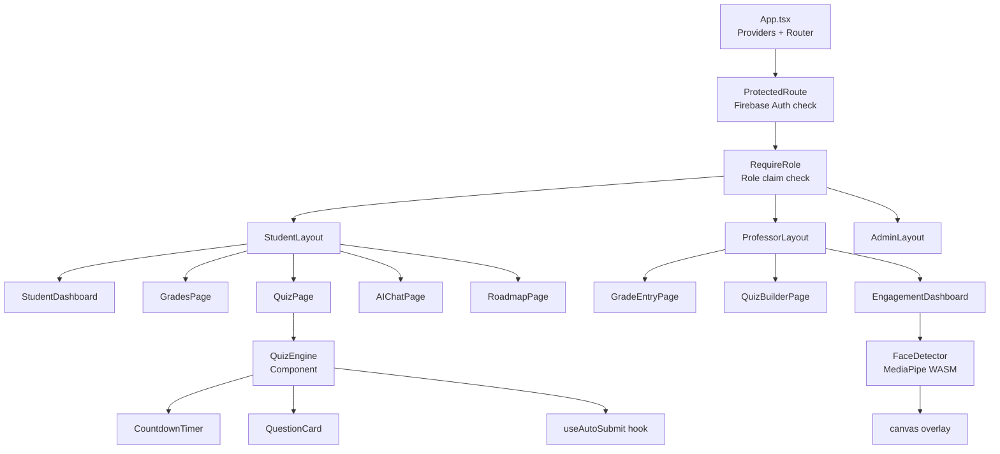
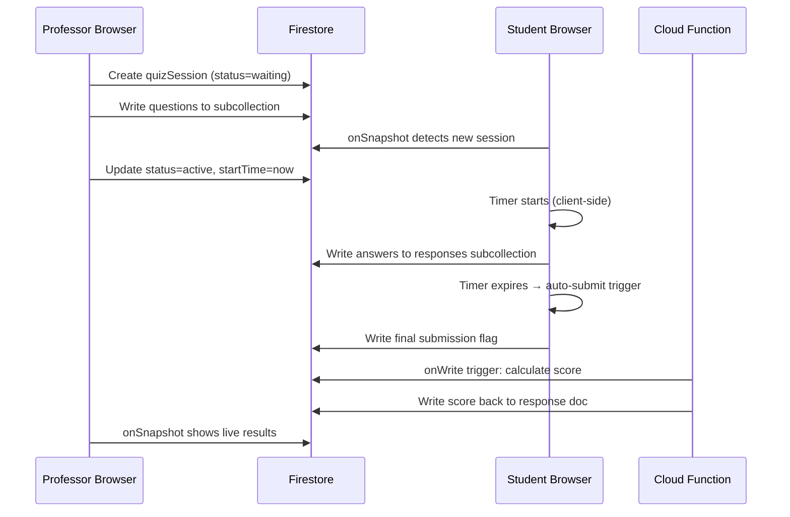

# Frontend Architecture

## 1. Overview

The React 18 frontend is the user-facing layer of the university management system. It is a TypeScript single-page application that integrates two distinct backends (the .NET academic API and Firebase for real-time classroom operations) under a single, role-driven interface.

The application supports five roles, each with a completely separate route tree and feature set. The system uses a dual route guard architecture to enforce role-based access both at the navigation level and at the data level.

---

## 2. Technology Stack

| Concern | Technology |
|---------|-----------|
| UI framework | React 18 + TypeScript |
| Styling | Material UI (MUI) + Tailwind CSS |
| Routing | React Router v6 |
| State management | React Context + custom hooks |
| HTTP client | Axios (for .NET API) |
| Real-time DB | Firebase Firestore (onSnapshot) |
| Auth | Firebase Auth (classroom) + JWT (academic) |
| Serverless | Firebase Cloud Functions (Node.js) |
| File handling | Firebase Storage + Cloudflare R2 (via .NET) |
| Face detection | Google MediaPipe (WASM, in-browser) |
| Build tool | Vite |
| Deployment | Firebase Hosting |

---

## 3. Application Structure

```
src/
├── app/
│   ├── App.tsx                    — root component, router, providers
│   ├── routes/
│   │   ├── StudentRoutes.tsx
│   │   ├── ProfessorRoutes.tsx
│   │   ├── AssistantRoutes.tsx
│   │   ├── AdminRoutes.tsx
│   │   └── SuperAdminRoutes.tsx
│   └── guards/
│       ├── RequireRole.tsx        — role-based access guard
│       └── ProtectedRoute.tsx     — auth state guard
│
├── features/
│   ├── auth/                      — login, token management
│   ├── student/
│   │   ├── grades/
│   │   ├── enrollments/
│   │   ├── roadmap/
│   │   ├── quiz/
│   │   └── ai-chat/
│   ├── professor/
│   │   ├── grading/
│   │   ├── assignments/
│   │   ├── quiz-builder/
│   │   └── engagement/
│   ├── assistant/
│   │   ├── attendance/
│   │   └── announcements/
│   ├── admin/
│   │   ├── users/
│   │   └── bulk-import/
│   └── superadmin/
│       └── regulations/
│
├── shared/
│   ├── components/               — reusable UI components
│   ├── hooks/                    — shared custom hooks
│   ├── services/
│   │   ├── api.ts                — Axios instance + interceptors
│   │   ├── firebase.ts           — Firebase app initialization
│   │   └── functions.ts          — Cloud Function callers
│   └── types/                    — shared TypeScript types
│
└── config/
    ├── firebase.config.ts
    └── routes.config.ts
```

---

## 4. Component Hierarchy



---

## 5. Dual Route Guard System

The application uses two separate guard components that compose to create the complete access control layer:

### 5.1 `ProtectedRoute`

Checks whether the user is authenticated at all (has a valid Firebase session).

```typescript
// If no Firebase user → redirect to /login
// If Firebase user exists → render children
const ProtectedRoute = ({ children }) => {
  const { user, loading } = useFirebaseAuth();
  if (loading) return <LoadingSpinner />;
  if (!user) return <Navigate to="/login" replace />;
  return children;
};
```

### 5.2 `RequireRole`

Checks whether the authenticated user's custom claims include the required role.

```typescript
// If user.role !== allowedRole → redirect to /unauthorized
const RequireRole = ({ role, children }) => {
  const { claims } = useFirebaseAuth();
  if (claims?.role !== role) return <Navigate to="/unauthorized" replace />;
  return children;
};
```

### 5.3 Guard Composition

```tsx
<ProtectedRoute>
  <RequireRole role="Student">
    <StudentRoutes />
  </RequireRole>
</ProtectedRoute>
```

This two-layer design means authentication and authorization are independently composable and testable.

---

## 6. Firebase Data Layer Patterns

### 6.1 Real-Time Listener Pattern

All classroom data (quizzes, attendance, engagement) uses Firestore `onSnapshot` for real-time updates:

```typescript
useEffect(() => {
  const unsubscribe = onSnapshot(
    query(collection(db, "quizSessions"), where("offeringId", "==", id)),
    (snapshot) => {
      const sessions = snapshot.docs.map(doc => ({ id: doc.id, ...doc.data() }));
      setQuizSessions(sessions);
    }
  );
  return () => unsubscribe(); // cleanup on unmount
}, [id]);
```

### 6.2 Firestore Collections

| Collection | Document | Purpose |
|-----------|----------|---------|
| `quizSessions` | `{sessionId}` | Active quiz metadata (title, timer, status) |
| `quizQuestions` | `{sessionId}/questions/{qId}` | Questions for a session |
| `quizResponses` | `{sessionId}/responses/{studentId}` | Student answer submissions |
| `attendanceSessions` | `{sessionId}` | Attendance event metadata |
| `attendanceRecords` | `{sessionId}/records/{studentId}` | Per-student attendance status |
| `chatHistory` | `{userId}/sessions/{sessionId}` | AI chat conversation turns |
| `engagementScores` | `{offeringId}/scores/{date}` | Aggregated daily engagement metrics |

### 6.3 Write via Cloud Functions (not client-direct)

Sensitive writes (e.g., scoring, bulk imports) are always routed through Firebase Cloud Functions, not written directly from the browser. This allows server-side validation and audit logging.

---

## 7. State Management Strategy

The application deliberately avoids heavy state management libraries (Redux, Zustand) in favor of:

1. **React Context** for global state (auth, current user, theme).
2. **Custom hooks** for feature-level state encapsulation.
3. **Firestore onSnapshot** as the reactive state source for real-time data.
4. **React Query** (or SWR) for .NET API calls — handles caching, background refetch, loading/error states.

### 7.1 Auth Context

```typescript
interface AuthContextValue {
  user: FirebaseUser | null;
  claims: CustomClaims | null;   // { role, departmentId, entityId }
  jwtToken: string | null;       // .NET JWT from login
  loading: boolean;
  logout: () => void;
}
```

The Auth Context holds both the Firebase user (for classroom features) and the .NET JWT token (for academic features). On login:
1. User authenticates with Firebase Auth.
2. Firebase ID token custom claims provide the role.
3. The same credentials are sent to `.NET /api/auth/login` to receive the academic JWT.
4. Both tokens are stored in the Auth Context.

---

## 8. Quiz Engine Design

The real-time quiz engine allows professors to run live, timed quizzes with immediate feedback.

### 8.1 Data Flow



### 8.2 Timer and Auto-Submit

The quiz timer is managed client-side using `useEffect` + `setInterval`. When the countdown reaches zero, the `useAutoSubmit` hook:
1. Collects all current answers from local component state.
2. Writes them to Firestore with `{ submitted: true, submittedAt: serverTimestamp() }`.
3. Navigates the student to the results page.

This prevents students from submitting after time expires because the Cloud Function scoring function ignores responses with `submittedAt > (startTime + durationSeconds)`.

### 8.3 AI Quiz Generation

Professors can generate questions from lecture content:

1. Professor selects a subject, chapter, and question count.
2. React calls Firebase Cloud Function `generateQuiz`.
3. Cloud Function forwards the request to FastAPI `exam_engine` module.
4. FastAPI retrieves lecture chunks from ChromaDB, calls Claude, returns structured questions.
5. Cloud Function writes questions to Firestore.
6. Professor's React page receives the questions via onSnapshot and can edit before publishing.

---

## 9. Engagement Tracker Design

The engagement tracker uses Google MediaPipe's Face Mesh model to detect student face presence and estimate attention levels during class sessions.

### 9.1 MediaPipe Pipeline

```mermaid
flowchart LR
    WEBCAM[Browser Webcam\ngetUserMedia] --> CANVAS[Hidden Canvas\n640x480]
    CANVAS --> MEDIAPIPE[MediaPipe FaceMesh\nWASM in-browser]
    MEDIAPIPE --> DETECT{Face detected?}
    DETECT -->|Yes| SCORE[Compute engagement score\nbased on face landmarks]
    DETECT -->|No| ZERO[Score = 0]
    SCORE --> BUFFER[Local score buffer\n(5-second window)]
    ZERO --> BUFFER
    BUFFER --> FUNC[Firebase Cloud Function\nwrite aggregate score]
    FUNC --> FS[Firestore\nengagementScores]
```

### 9.2 Scoring Logic

- Face detected + looking toward screen: score 100
- Face detected + looking away (yaw > 30°): score 50
- No face detected: score 0
- Scores are averaged over 5-second windows before writing to Firebase (to reduce write frequency).

### 9.3 Privacy Considerations

- No images or video are stored or transmitted. Only numeric scores reach Firebase.
- The MediaPipe model runs entirely in the browser (WASM) — no webcam data leaves the device.
- Students are informed of tracking via consent dialog before the session starts.

---

## 10. HTTP Layer (.NET API Calls)

The Axios instance is configured with interceptors for automatic token injection and refresh:

```typescript
// Request interceptor: inject JWT
api.interceptors.request.use(config => {
  const token = getToken();
  if (token) config.headers.Authorization = `Bearer ${token}`;
  return config;
});

// Response interceptor: handle 401 → refresh token
api.interceptors.response.use(
  response => response,
  async error => {
    if (error.response?.status === 401 && !error.config._retry) {
      error.config._retry = true;
      const newToken = await refreshAccessToken();
      setToken(newToken);
      error.config.headers.Authorization = `Bearer ${newToken}`;
      return api(error.config);
    }
    return Promise.reject(error);
  }
);
```

This transparent token refresh ensures users never see a 401 error due to token expiry during normal use.

---

## 11. Bulk User Import

The Admin role can import students or professors in bulk from an Excel file.

**Flow:**
1. Admin selects Excel file in React UI.
2. React uploads the file to Firebase Storage.
3. React calls Cloud Function `bulkImport` with the storage path.
4. Cloud Function parses the Excel file (using `xlsx` npm package).
5. For each row, Cloud Function:
   a. Creates a Firebase Auth user with the generated email/password.
   b. Sets custom claims (`role`, `departmentId`).
   c. Writes the user record to Firestore.
   d. Calls .NET `POST /api/students` or `/api/professors` to create the academic record.
6. Cloud Function returns a summary: `{ created: 45, failed: 2, errors: [...] }`.
7. React displays the result report.
