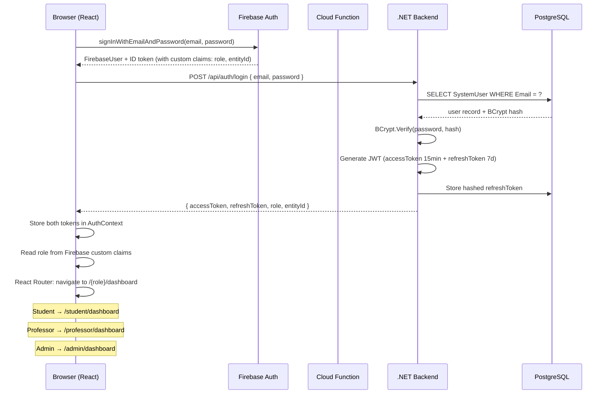
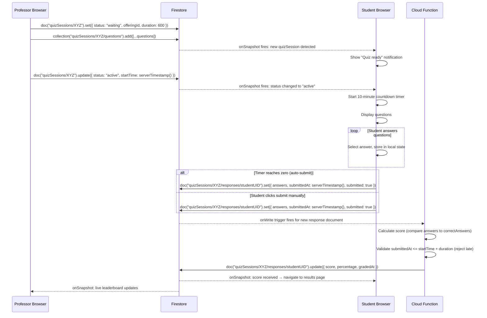
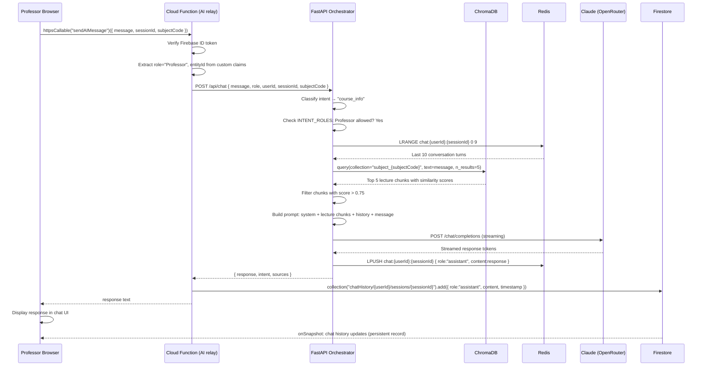
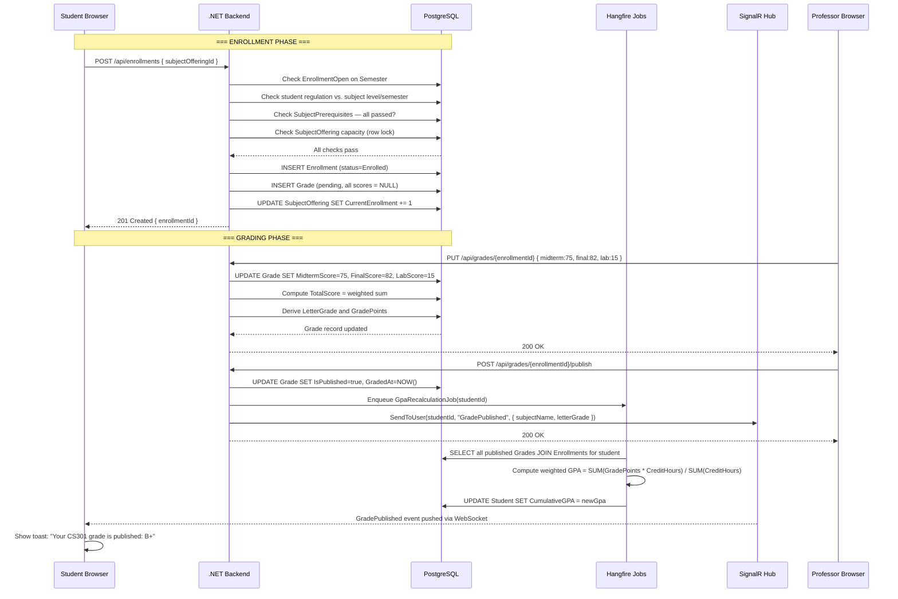
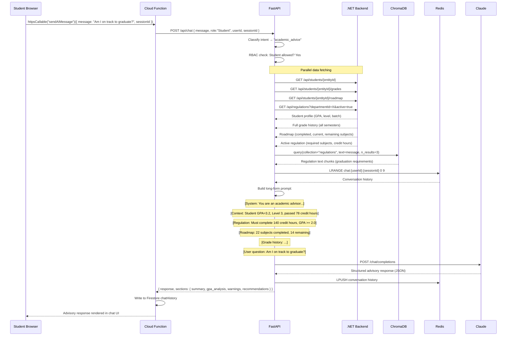
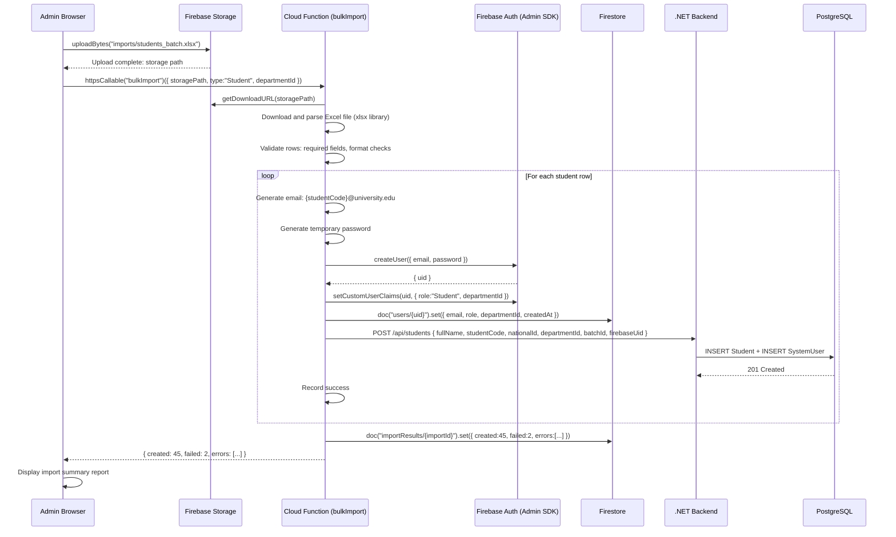
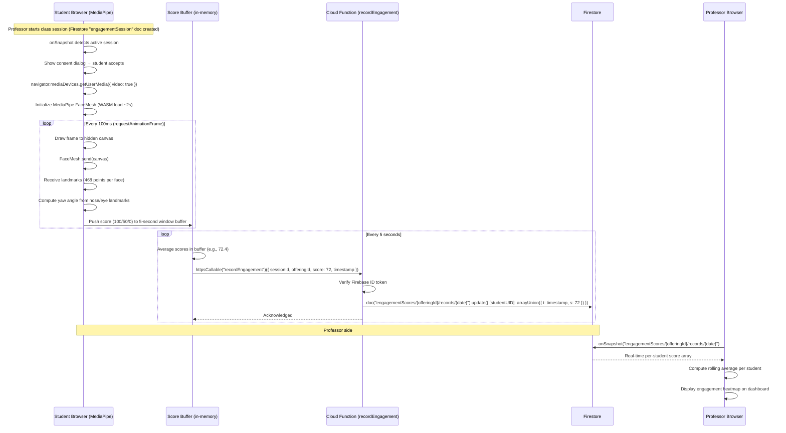

# Data Flow Diagrams

This document contains Mermaid sequence diagrams for the seven most important user journeys in the university management system. Each diagram traces the full path of a request from the user's browser through all services and back.

---

## Flow 1 — Student Login and Role-Based Routing

This flow shows how a user logs in, receives tokens from both Firebase and .NET, and is routed to their role-specific dashboard.

---

## Flow 2 — Student Takes a Live Quiz

This flow shows the complete quiz lifecycle: professor starts it, students receive it in real-time, answer, submit, and receive scores.

---

## Flow 3 — AI Chat: Professor Asks a Question About a Lecture

This flow shows how a professor's natural-language question reaches the AI service, retrieves lecture content, and returns a grounded answer.

---

## Flow 4 — Enrollment and Grade Recording

This flow covers the complete academic lifecycle of one enrollment: student enrolls, professor enters grades, grades are published, and GPA is updated.

---

## Flow 5 — AI Academic Advisor Query

This is the most complex flow in the system: the `academic_advisor` module combines regulation data, student roadmap, grade history, and LLM analysis to produce a deep advisory response.

---

## Flow 6 — Bulk User Import

This flow shows how an admin imports a batch of students from an Excel file, creating both Firebase and .NET records.

---

## Flow 7 — Engagement Tracking (Webcam to Firestore)

This flow shows how student attention is measured in real-time using MediaPipe in the browser and aggregated to Firestore.

---

## Summary

| Flow | Primary Services | Key Pattern |
|------|-----------------|-------------|
| 1. Login + routing | Firebase Auth + .NET | Dual-token auth |
| 2. Live quiz | Firestore + Cloud Function | Real-time onSnapshot + serverless scoring |
| 3. AI chat (lecture Q&A) | FastAPI + ChromaDB + Claude | RAG retrieval |
| 4. Enrollment + grading | .NET + Hangfire + SignalR | Background job + real-time push |
| 5. AI academic advisor | FastAPI + .NET + Claude | Orchestrator + parallel data fetch |
| 6. Bulk import | Firebase + Cloud Function + .NET | Serverless batch processing |
| 7. Engagement tracking | MediaPipe + Firebase | In-browser ML + real-time aggregation |
