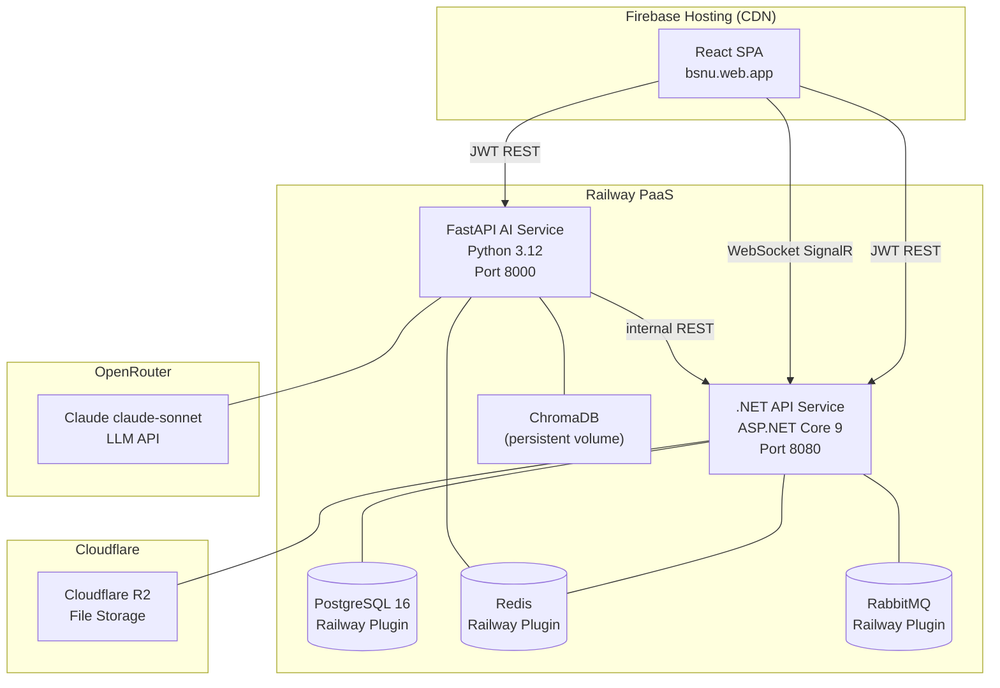

# Scalability and Deployment

## 1. Overview

The system is deployed on Railway PaaS, which hosts all backend services: the .NET API, FastAPI AI service, PostgreSQL, Redis, and RabbitMQ. The React frontend is a static SPA deployed to Firebase Hosting (CDN only — no Firebase backend services are used). Cloudflare R2 handles object storage independently.

---

## 2. Deployment Architecture



---

## 3. Railway Deployment (.NET + FastAPI)

### 3.1 Service Configuration

Each Railway service is deployed from a GitHub repository via Railway's CI/CD integration. On every push to `main`, Railway:

1. Detects the Dockerfile or Nixpacks buildpack.
2. Builds the container image.
3. Runs database migrations (.NET only: `context.Database.Migrate()` on startup).
4. Performs a rolling deployment (zero-downtime swap).

### 3.2 .NET Service

```yaml
# railway.toml (conceptual)
[build]
  builder = "DOCKERFILE"
  dockerfilePath = "Dockerfile"

[deploy]
  startCommand = "dotnet MyApp.dll"
  healthcheckPath = "/health"
  healthcheckTimeout = 30
  restartPolicyType = "ON_FAILURE"
```

**Environment variables on Railway:**
- `DATABASE_URL` — PostgreSQL connection string
- `JWT_SECRET` — HMAC-SHA256 signing key
- `CLOUDFLARE_R2_*` — R2 access key, secret, bucket name, endpoint
- `REDIS_URL` — Redis connection string
- `RABBITMQ_URL` — RabbitMQ connection string
- `CORS_ORIGINS` — `https://bsnu.web.app` (Firebase Hosting domain)

### 3.3 FastAPI Service

```dockerfile
FROM python:3.12-slim
WORKDIR /app
COPY requirements.txt .
RUN pip install -r requirements.txt
COPY . .
CMD ["uvicorn", "main:app", "--host", "0.0.0.0", "--port", "8000", "--workers", "2"]
```

**Environment variables:**
- `OPENROUTER_API_KEY` — OpenRouter API key
- `DOTNET_API_URL` — Internal Railway URL of the .NET service
- `REDIS_URL` — Redis connection string
- `CHROMADB_PATH` — Persistent volume path for ChromaDB data

### 3.4 Railway Auto-Scaling

Railway scales services vertically (increasing CPU/RAM on the same instance) based on usage metrics. For the current load profile (university of ~2000 students), a single instance of each service is sufficient. Railway's configuration supports horizontal scaling via the `numReplicas` setting if needed.

### 3.5 Private Networking

Railway services within the same project communicate over Railway's private network using internal hostnames (e.g., `dotnet-api.railway.internal`). This eliminates public internet round-trips for FastAPI → .NET calls and reduces latency by ~50ms compared to external DNS resolution.

---

## 4. Firebase Hosting (Frontend CDN)

Firebase Hosting is used exclusively to serve the pre-built React SPA static files. No Firebase backend services (Firestore, Auth, Cloud Functions, Storage) are used.

### 4.1 Deployment Command

```bash
vite build && firebase deploy --only hosting
```

**Benefits:**
- Global CDN with edge caching (sub-100ms load times worldwide).
- Automatic HTTPS with Google-managed SSL certificates.
- Single-command deployment with atomic snapshot promotion.
- Custom domain support (`bsnu.web.app`).

The React app makes all dynamic requests to Railway-hosted services (`.NET` and `FastAPI`) — Firebase Hosting only serves the initial HTML/JS/CSS bundle.

---

## 5. ChromaDB Scaling

ChromaDB runs in-process with the FastAPI service (embedded mode) for simplicity and low latency. The current dataset (lecture PDFs for a university) is estimated at 50,000–200,000 embedding vectors, which fits comfortably in ChromaDB's in-memory + disk persistence model.

**Current limitations:**
- Single-node (embedded mode). Cannot be shared across multiple FastAPI instances.
- Data is stored on Railway's ephemeral filesystem unless a persistent volume is attached.

**Railway persistent volume:** A Railway volume is attached to the FastAPI service at the `CHROMADB_PATH` mount point. This ensures ChromaDB data survives service restarts and redeployments.

**Future scaling path:** If multiple FastAPI instances are needed, ChromaDB should be migrated to server mode running as a separate Railway service, and all FastAPI instances connect to it via HTTP.

---

## 6. Redis Memory Management

Redis is used for two purposes:
1. **Conversation memory:** Per-session chat history (TTL: 24 hours).
2. **Distributed cache / rate limiting:** .NET uses Redis for rate limit counters.

**Memory management strategy:**
- All chat session keys have a 24-hour TTL, which automatically evicts stale sessions.
- Redis is configured with `maxmemory-policy: allkeys-lru`, ensuring that when memory is full, the least-recently-used keys are evicted first.
- Current estimated memory usage: ~5MB per 100 active sessions. At 500 concurrent sessions, this is 25MB — well within Railway's Redis plugin allocation.

---

## 7. PostgreSQL Connection Pooling

The .NET service maintains a connection pool to PostgreSQL:

| Parameter | Value | Rationale |
|-----------|-------|-----------|
| Minimum pool size | 5 | Keep warm connections ready |
| Maximum pool size | 100 | Railway PostgreSQL plugin limit |
| Connection timeout | 15s | Fail fast if DB is unavailable |
| Command timeout | 30s | Prevent long-running query accumulation |
| Connection lifetime | 300s | Recycle connections to avoid stale TCP sessions |

Npgsql (the .NET PostgreSQL driver) manages the pool internally. The application never holds a connection longer than a request lifecycle.

---

## 8. Hangfire Background Jobs

Hangfire is the .NET background job processing library. It runs scheduled and triggered jobs:

| Job | Trigger | Description |
|-----|---------|-------------|
| `GpaRecalculationJob` | On grade publish | Recalculates and updates student CumulativeGPA |
| `EnrollmentWindowJob` | Cron (daily) | Opens/closes enrollment windows based on semester dates |
| `DeadlineReminderJob` | Cron (daily 8AM) | Sends notifications for upcoming assignment deadlines |
| `NotificationDispatchJob` | On announcement create | Sends announcement notifications to target role group |
| `AcademicRiskJob` | Cron (daily 6AM) | GPA + attendance risk scoring across all active offerings |
| `RagIndexingJob` | Cron (daily) | Indexes unindexed materials into ChromaDB |
| `ComplaintIntelligenceJob` | Daily / Weekly / Monthly | AI intelligence reports for admin |
| `ExamReminderJob` | Cron (every 30 min) | 24h / 2h exam reminders to enrolled students |

**Hangfire storage:** Hangfire uses the same PostgreSQL database for its job queue and execution history. A dedicated schema (`hangfire`) separates Hangfire tables from application tables.

**Dashboard:** Hangfire's built-in dashboard is available at `/hangfire` (protected by admin auth), allowing admins to view job history, retry failed jobs, and monitor execution times.

---

## 9. Current Bottlenecks

### 9.1 AI Response Latency

- **Problem:** LLM calls to Claude average 2–4 seconds. For complex queries (academic_advisor), the total round-trip (API fetch + RAG + LLM) can reach 6–8 seconds.
- **Mitigation:** Streaming responses are enabled — the client receives tokens progressively rather than waiting for the complete response.
- **Future improvement:** Cache common regulation queries in Redis with a 1-hour TTL. Cache student profile data for 5 minutes.

### 9.2 ChromaDB Cold Start

- **Problem:** On FastAPI service restart, ChromaDB loads its full collection from disk, causing 2–5 second initialization delay.
- **Mitigation:** Railway keeps the service warm; restarts are rare.
- **Future improvement:** Lazy collection loading — only load collections on first query.

### 9.3 Enrollment Window Race Conditions

- **Problem:** During peak enrollment (semester start), many students may attempt to enroll in the same offering simultaneously.
- **Mitigation:** Optimistic concurrency with row-level locking on `SubjectOfferings`. The SQL update uses a `WHERE CurrentEnrollment < MaxEnrollment` condition — if it fails, the application returns a 409 Conflict.

---

## 10. Future Scalability Recommendations

| Area | Recommendation | Priority |
|------|---------------|----------|
| Database reads | Add PostgreSQL read replica for reporting queries | Medium |
| AI caching | Cache LLM responses for identical queries (regulations, course info) | High |
| CDN for files | Serve lecture PDFs via Cloudflare CDN (R2 is already CDN-backed) | Low |
| Load balancing | Add a second .NET instance behind Railway's load balancer | Medium |
| ChromaDB | Migrate to ChromaDB server mode when FastAPI scales beyond 1 instance | Medium |
| Monitoring | Add APM (Sentry or Datadog) | High |
| Rate limiting | Implement per-student rate limiting on enrollment endpoint | Medium |
