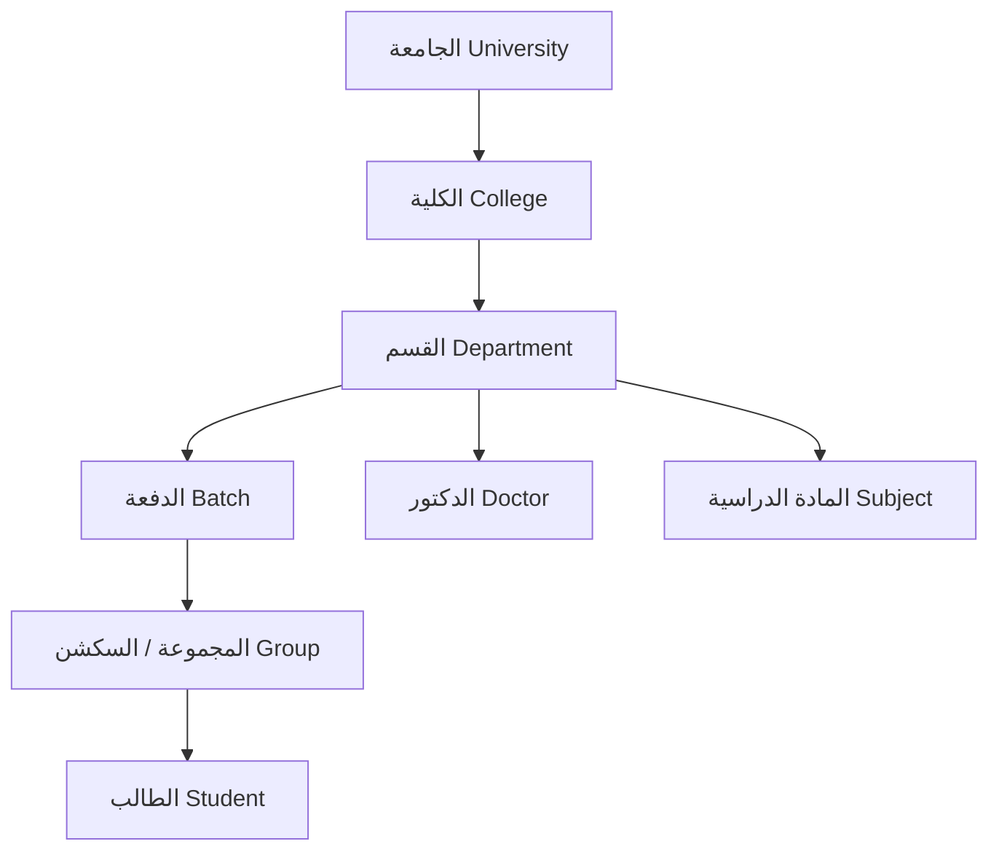
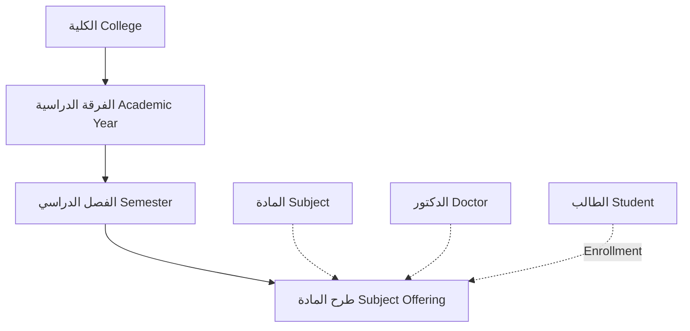

# الهيكل العام للنظام (System Architecture & Hierarchy)

النظام مبني على تسلسل هرمي أكاديمي متكامل، يبدأ من مستوى الجامعة وصولاً إلى الطالب والمادة الدراسية.

## التقسيمة الهرمية الأساسية (The Core Hierarchy)

التسلسل الهرمي ينقسم إلى شقين: **الشق الهيكلي/الإداري** و **الشق الأكاديمي/الزمني**.

### 1. الشق الهيكلي والإداري (Structural Hierarchy)
هذا الشق يمثل البنية التحتية الفيزيائية والإدارية للجامعة:

- **الجامعة (University)**: الكيان الأكبر الذي يحتوي على عدة كليات.
- **الكلية (College)**: تابعة للجامعة وتحتوي على عدة أقسام وفرق دراسية.
- **القسم (Department)**: تابع للكلية (مثال: قسم علوم الحاسب، قسم نظم المعلومات). يندرج تحته الدفعات، الدكاترة، والمواد الدراسية الخاصة بهذا القسم.
- **الدفعة (Batch)**: مجموعة الطلبة الذين التحقوا بالقسم في نفس السنة (مثال: دفعة 2024).
- **المجموعة (Group)**: السكشن أو الجروب الفرعي داخل الدفعة لتسهيل إدارة أعداد الطلبة وجداولهم.
- **الطالب (Student)**: ينتمي لمجموعة محددة.
- **الدكتور (Doctor)**: ينتمي لقسم محدد.
- **المادة (Subject)**: تابعة لقسم معين (القسم المسؤول عن تدريسها).

### 2. الشق الزمني والأكاديمي (Academic Hierarchy)
هذا الشق يمثل تقدم الطالب عبر السنين والفصول الدراسية:

- **الفرقة الدراسية (Academic Year)**: (مثال: الفرقة الأولى، الفرقة الثانية). ترتبط بالكلية بشكل مباشر، ويتم ربطها بالأقسام المتاحة لها من خلال `AcademicYearDepartment` (حيث لا تكون كل الأقسام متاحة في كل الفرق، مثلاً التشعيب يبدأ من الفرقة الثالثة).
- **الفصل الدراسي (Semester)**: تابع للفرقة الدراسية (مثال: الترم الأول، الترم الثاني، السمر كورس).
- **طرح المادة (Subject Offering)**: هي نقطة الالتقاء. حيث يتم فتح مادة معينة في فصل دراسي معين، وتكليف دكتور بتدريسها، ويقوم الطلاب بالتسجيل فيها (Enrollment).

---

# صلاحيات ومهام مدير النظام (Admin Tasks & Permissions)

مدير النظام (Admin) يملك صلاحيات كاملة على كافة أجزاء النظام (Full CRUD Operations)، وهي كالتالي:

## 1. إدارة الهيكل الجامعي (Structure Management)
- **الجامعات والكليات**: إضافة وتعديل وحذف الجامعات والكليات.
- **الأقسام**: إنشاء الأقسام وتعيينها لكليات محددة.
- **الدفعات والمجموعات**: إنشاء الدفعات الأكاديمية داخل الأقسام، وتقسيم الدفعات إلى مجموعات (Groups) لتوزيع الطلاب عليها.

## 2. الإدارة الأكاديمية (Academic Management)
- **الفرق الدراسية (Academic Years)**: إنشاء الفرق (الفرقة الأولى، الثانية، الخ) وربطها بالكليات.
- **ربط الأقسام بالفرق**: تحديد الأقسام المتاحة لكل فرقة دراسية (مثلاً القسم العام للفرقة الأولى، وأقسام التخصص للفرق الأعلى).
- **الفصول الدراسية (Semesters)**: فتح وإغلاق الفصول الدراسية لكل فرقة، وتحديد تواريخ البدء والانتهاء.
- **المواد الدراسية (Subjects)**: إضافة المواد وتحديد الساعات المعتمدة الخاصة بها وربطها بأقسامها.
- **طرح المواد (Subject Offerings)**: تفعيل مادة معينة في فصل دراسي معين (فتح باب التسجيل لها) وتعيين الدكتور المنسق لها.

## 3. إدارة المستخدمين (User & Identity Management)
- **الطلاب**: تسجيل بيانات الطلاب، إصدار هوياتهم الجامعية (University ID)، وتسكينهم في الدفعات والمجموعات الخاصة بهم.
- **أعضاء هيئة التدريس (Doctors)**: إضافة الدكاترة وتسكينهم في الأقسام الأكاديمية وربط حساباتهم وصلاحياتهم.
- **المسؤولين (Admins)**: إضافة مسؤولين فرعيين وإدارة صلاحياتهم (Admin vs SuperAdmin).

## 4. العمليات اليومية وإدارة شؤون الطلاب (Operations & Enrollments)
- **التسجيل (Enrollment)**: الإدارة اليدوية أو الاستثنائية لتسجيل الطلاب في المواد (في حال وجود مشاكل في التسجيل الذاتي أو استثناءات للمتطلبات السابقة).
- **الغياب والحضور (Attendance)**: مراقبة وتعديل سجلات الحضور الخاصة بالطلاب في المواد المختلفة في حال استدعى الأمر تدخل الإدارة.
- **اللوائح (Regulations)**: إدخال وتعديل لوائح الكلية (قواعد الـ GPA، الإنذار الأكاديمي، شروط التخرج).

## 5. إدارة التقييمات والنتائج (Exams & Grades)
- **إدارة الامتحانات**: إمكانية استعراض وجدولة الامتحانات، ومراقبة حالة إنشائها.
- **رصد الدرجات (Grades & GPA)**: الإشراف على رصد الدرجات وحسابات الـ GPA التراكمي والفصلي، وإصدار أو اعتماد النتائج النهائية للطلاب.

## 6. إعدادات النظام المتقدمة (System & AI Tools)
- **الذكاء الاصطناعي**: إدارة أدوات الذكاء الاصطناعي المتوفرة في النظام للمستخدمين.
- **سجلات التدقيق (Audit Logs)**: مراقبة حركات النظام وتتبع من قام بأي تعديل (صلاحية SuperAdmin).
- **الإشعارات**: إرسال إشعارات عامة (Broadcast) للطلاب أو الدكاترة.

---

> [!TIP]
> **واجهة الإدارة (Admin Frontend Dashboard):** 
> ستحتوي واجهة الأدمن على **Navigation Menu** جانبية تنقسم إلى:
> 1. **إدارة الهيكل** (جامعة، كليات، أقسام، دفعات، مجموعات)
> 2. **الشؤون الأكاديمية** (فرق دراسية، فصول دراسية، لوائح)
> 3. **المواد والتسجيل** (المواد الأساسية، المواد المطروحة، تسجيلات الطلاب)
> 4. **شؤون الطلاب** (قوائم الطلاب، سجلات الدرجات والـ GPA، الحضور)
> 5. **شؤون الأعضاء** (قوائم الدكاترة، توزيع المهام)
> 6. **الإعدادات والتقارير** (Audit Logs, AI Configs)
